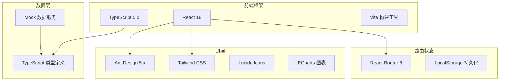
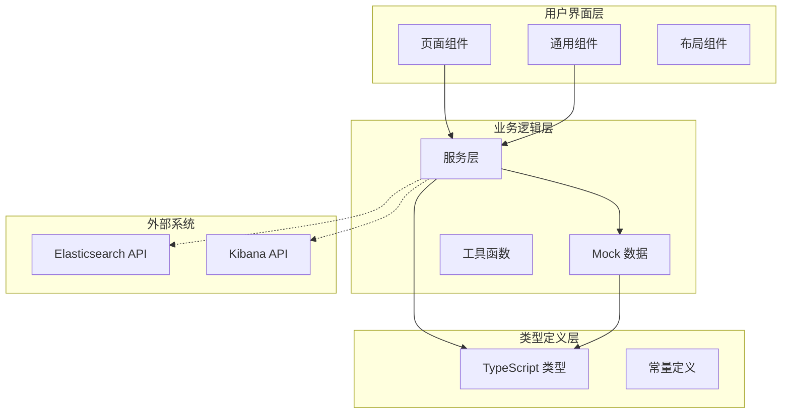
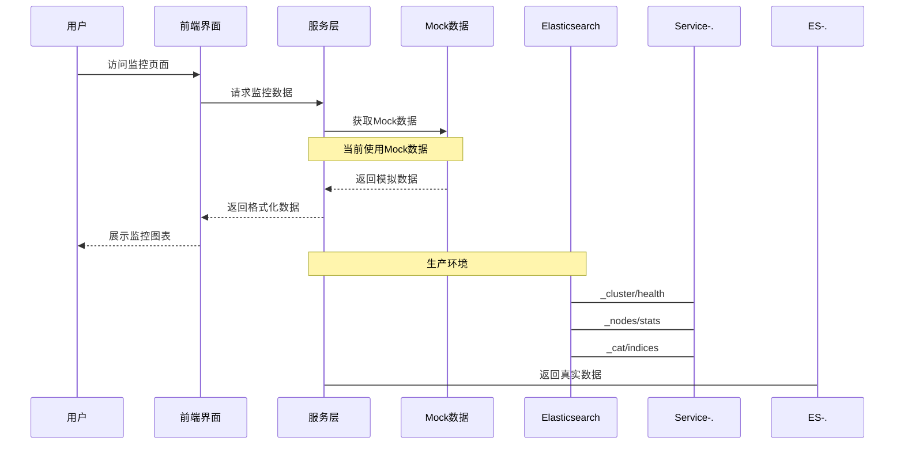
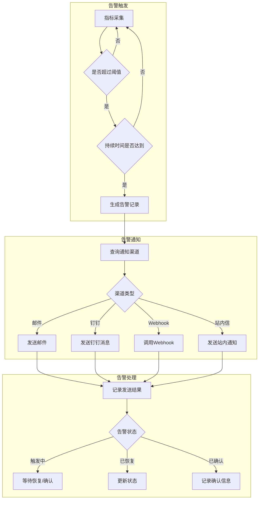
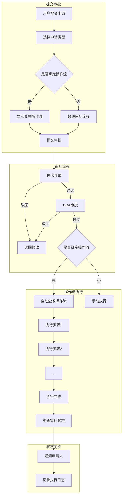
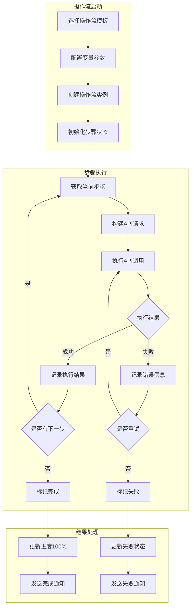
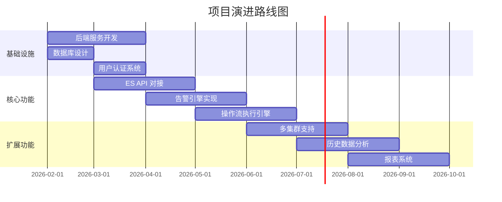

# ES Monitor Web 技术委员会文档

## 1. 项目概述

ES Monitor Web 是一个基于 React + TypeScript 的 Elasticsearch 监控管理平台，提供集群监控、告警管理、审批流程、操作流自动化等功能。

### 1.1 项目信息

| 项目属性 | 说明 |
|---------|------|
| 项目名称 | es-monitor-web-kiro |
| 版本 | 1.0.0 |
| 开发语言 | TypeScript |
| 前端框架 | React 18 |
| 构建工具 | Vite |
| UI 框架 | Ant Design 5.x + Tailwind CSS |
| 目标 ES 版本 | Elasticsearch 9.0 |

---

## 2. 技术栈

### 2.1 核心技术



### 2.2 依赖清单

| 依赖包 | 版本 | 用途 |
|-------|------|------|
| react | ^18.x | 前端框架 |
| react-dom | ^18.x | React DOM 渲染 |
| react-router-dom | ^6.x | 路由管理 |
| antd | ^5.x | UI 组件库 |
| tailwindcss | ^3.x | 原子化 CSS |
| echarts | ^5.x | 图表可视化 |
| echarts-for-react | ^3.x | ECharts React 封装 |
| lucide-react | ^0.x | 图标库 |
| typescript | ^5.x | 类型系统 |
| vite | ^5.x | 构建工具 |

---

## 3. 架构设计

### 3.1 整体架构



### 3.2 目录结构

```
es-monitor-web-kiro/
├── src/
│   ├── components/          # 通用组件
│   │   ├── MetricChart.tsx     # 指标图表
│   │   └── TimeRangeSelector.tsx # 时间范围选择器
│   ├── layouts/             # 布局组件
│   │   └── MainLayout.tsx      # 主布局（侧边栏+顶栏）
│   ├── pages/               # 页面组件
│   │   ├── Overview/           # 监控概览
│   │   ├── Cluster/            # 集群信息
│   │   ├── Nodes/              # 节点列表
│   │   ├── NodeDetail/         # 节点详情
│   │   ├── Indices/            # 索引列表
│   │   ├── IndexDetail/        # 索引详情
│   │   ├── Alerts/             # 告警中心
│   │   ├── AlertRules/         # 告警规则
│   │   ├── AlertRecords/       # 告警记录
│   │   ├── NotificationChannels/ # 通知渠道
│   │   ├── ApprovalList/       # 审批列表
│   │   ├── ApprovalSubmit/     # 提交审批
│   │   ├── ApprovalDetail/     # 审批详情
│   │   ├── Workflows/          # 操作流管理
│   │   ├── IndexManage/        # 索引管理
│   │   ├── DevTools/           # 开发控制台
│   │   └── Analyzer/           # 分析器
│   ├── services/            # 服务层
│   │   ├── mockData.ts         # 监控 Mock 数据
│   │   ├── alertMockData.ts    # 告警 Mock 数据
│   │   ├── approvalMockData.ts # 审批 Mock 数据
│   │   └── workflowMockData.ts # 操作流 Mock 数据
│   ├── types/               # 类型定义
│   │   ├── elasticsearch.ts    # ES 相关类型
│   │   └── index.ts            # 类型导出
│   ├── constants/           # 常量定义
│   │   └── index.ts
│   ├── App.tsx              # 应用入口
│   └── main.tsx             # 渲染入口
├── public/                  # 静态资源
├── index.html               # HTML 模板
├── vite.config.ts           # Vite 配置
├── tailwind.config.js       # Tailwind 配置
├── tsconfig.json            # TypeScript 配置
└── package.json             # 项目配置
```

---

## 4. 核心类型定义

### 4.1 集群与节点类型

```typescript
// 集群健康状态
type ClusterHealthStatus = 'green' | 'yellow' | 'red';

// 集群健康信息
interface ClusterHealth {
  cluster_name: string;
  status: ClusterHealthStatus;
  number_of_nodes: number;
  number_of_data_nodes: number;
  active_primary_shards: number;
  active_shards: number;
  unassigned_shards: number;
  // ...更多字段
}

// 节点角色
type NodeRole = 'master' | 'data' | 'data_hot' | 'data_warm' | 'data_cold' | 'ingest' | 'ml' | ...;

// 节点统计信息
interface NodeStats {
  name: string;
  ip: string;
  version: string;
  roles: NodeRole[];
  os: NodeOsStats;
  jvm: NodeJvmStats;
  fs: NodeFsStats;
  indices: NodeIndicesStats;
  // ...更多字段
}
```

### 4.2 告警类型

```typescript
// 告警级别
type AlertSeverity = 'critical' | 'warning' | 'info';

// 告警状态
type AlertStatus = 'firing' | 'resolved' | 'acknowledged';

// 告警指标类型
type AlertMetricType = 
  | 'cluster_health' | 'node_cpu' | 'node_heap' | 'node_disk'
  | 'search_latency' | 'indexing_latency' | 'unassigned_shards' | ...;

// 告警规则
interface AlertRule {
  id: string;
  name: string;
  metric: AlertMetricType;
  operator: 'gt' | 'gte' | 'lt' | 'lte' | 'eq' | 'neq';
  threshold: number;
  duration: number;        // 持续时间（秒）
  severity: AlertSeverity;
  notificationChannels: string[];
  cooldown: number;        // 冷却时间（秒）
}

// 通知渠道类型
type NotificationChannelType = 'email' | 'dingtalk' | 'webhook' | 'sms' | 'internal';
```

### 4.3 审批类型

```typescript
// 申请类型
type ApprovalRequestType =
  | 'create_index' | 'delete_index' | 'update_mapping' | 'update_settings'
  | 'create_alias' | 'delete_alias' | 'update_alias'
  | 'create_template' | 'delete_template'
  | 'create_pipeline' | 'delete_pipeline'
  | 'reindex' | 'other';

// 审批状态
type ApprovalStatus = 'pending' | 'approved' | 'rejected' | 'cancelled' | 'processing' | 'completed' | 'failed';

// 审批申请
interface ApprovalRequest {
  id: string;
  title: string;
  type: ApprovalRequestType;
  status: ApprovalStatus;
  applicant: string;
  content: ApprovalContent;
  nodes: ApprovalNode[];     // 审批流程节点
  logs: ApprovalLog[];       // 审批日志
  notificationChannels: string[];
}
```

### 4.4 操作流类型

```typescript
// 原子操作类型
type AtomicOperationType =
  | 'read_index_config' | 'create_index' | 'update_mapping' | 'update_settings'
  | 'reindex' | 'create_alias' | 'switch_alias' | 'delete_alias' | 'delete_index'
  | 'verify_data' | 'backup_index' | 'custom_api' | 'custom_script';

// HTTP 方法
type HttpMethod = 'GET' | 'POST' | 'PUT' | 'DELETE' | 'HEAD';

// 原子操作 API 配置
interface AtomicOperationApiConfig {
  method: HttpMethod;
  endpoint: string;           // 支持变量如 /{{indexName}}/_settings
  body?: string;              // 请求体模板
  successCondition?: string;  // 成功条件表达式
}

// 原子操作定义
interface AtomicOperation {
  id: string;
  name: string;
  type: AtomicOperationType;
  description: string;
  apiConfig: AtomicOperationApiConfig;
  inputSchema: Record<string, unknown>;
  outputSchema?: Record<string, unknown>;
  isBuiltin: boolean;
}

// 操作流模板
interface WorkflowTemplate {
  id: string;
  name: string;
  description: string;
  category: 'index' | 'alias' | 'migration' | 'custom';
  steps: WorkflowStep[];
  boundApprovalTypes?: ApprovalRequestType[];  // 绑定的审批类型
}

// 操作流实例
interface WorkflowInstance {
  id: string;
  templateId?: string;
  name: string;
  status: WorkflowStatus;
  steps: WorkflowStep[];
  variables: Record<string, unknown>;
  approvalId?: string;        // 关联的审批ID
  triggerType?: 'manual' | 'approval';
  progress?: number;
}
```

---

## 5. 业务流程

### 5.1 监控数据流



### 5.2 告警处理流程



### 5.3 审批-操作流集成流程



### 5.4 操作流执行流程



---

## 6. 已实现功能

### 6.1 功能模块清单

| 模块 | 功能 | 状态 |
|------|------|------|
| **监控模块** | | |
| | 监控概览 | ✅ 已完成 |
| | 集群信息 | ✅ 已完成 |
| | 节点列表 | ✅ 已完成 |
| | 节点详情（独立页面+图表） | ✅ 已完成 |
| | 索引列表 | ✅ 已完成 |
| | 索引详情（独立页面+图表） | ✅ 已完成 |
| | 时间范围选择器 | ✅ 已完成 |
| **告警模块** | | |
| | 告警中心概览 | ✅ 已完成 |
| | 告警规则管理（多条件AND/OR） | ✅ 已完成 |
| | 告警记录（含持续时间、跳转监控） | ✅ 已完成 |
| | 通知渠道管理 | ✅ 已完成 |
| **审批模块** | | |
| | 审批列表 | ✅ 已完成 |
| | 提交审批 | ✅ 已完成 |
| | 审批详情（流程节点+日志） | ✅ 已完成 |
| | 审批-操作流集成 | ✅ 已完成 |
| **操作流模块** | | |
| | 原子操作CRUD | ✅ 已完成 |
| | 操作流模板管理 | ✅ 已完成 |
| | 操作流实例执行 | ✅ 已完成 |
| | 执行历史记录 | ✅ 已完成 |
| | 审批类型绑定 | ✅ 已完成 |
| **索引管理** | | |
| | 索引创建（从已有索引复制） | ✅ 已完成 |
| | 别名管理 | ✅ 已完成 |
| | 管道管理 | ✅ 已完成 |
| | 模板管理 | ✅ 已完成 |
| **开发工具** | | |
| | 控制台（100+查询示例） | ✅ 已完成 |
| | 自定义模板 | ✅ 已完成 |
| | 分析器测试 | ✅ 已完成 |

### 6.2 UI/UX 特性

- 类 Kibana 侧边栏布局，支持折叠
- 二级菜单分组展示
- 深色侧边栏 + 浅色内容区
- 响应式设计
- 中文界面和注释
- 标题使用 text-gray-900 确保可读性

---

## 7. 后续优化方向

### 7.1 短期优化

| 优化项 | 优先级 | 说明 |
|-------|--------|------|
| 接入真实 ES API | 高 | 替换 Mock 数据，对接真实 Elasticsearch |
| 用户认证 | 高 | 添加登录、权限管理 |
| 数据持久化 | 高 | 后端服务 + 数据库存储 |
| 告警规则引擎 | 中 | 实现真实的告警检测逻辑 |
| 操作流执行引擎 | 中 | 实现真实的 API 调用执行 |

### 7.2 中期优化

| 优化项 | 优先级 | 说明 |
|-------|--------|------|
| 多集群支持 | 中 | 支持管理多个 ES 集群 |
| 历史数据存储 | 中 | 监控数据持久化，支持历史查询 |
| 报表导出 | 低 | 支持监控报表 PDF/Excel 导出 |
| 移动端适配 | 低 | 响应式优化，支持移动端访问 |
| 国际化 | 低 | 支持多语言切换 |

### 7.3 长期规划



---

## 8. 技术决策记录

### 8.1 为什么选择 Vite

- 极快的冷启动速度
- 原生 ESM 支持
- 优秀的 TypeScript 支持
- 简洁的配置

### 8.2 为什么选择 Ant Design

- 企业级 UI 组件库
- 完善的 TypeScript 类型
- 丰富的组件生态
- 中文文档友好

### 8.3 为什么使用 Mock 数据

- 前端独立开发，不依赖后端
- 快速原型验证
- 便于演示和测试
- 类型定义先行，确保接口一致性

---

## 9. 附录

### 9.1 类型定义文件位置

- `src/types/elasticsearch.ts` - 所有类型定义（1483行）

### 9.2 Mock 数据文件位置

- `src/services/mockData.ts` - 监控数据（1015行）
- `src/services/alertMockData.ts` - 告警数据
- `src/services/approvalMockData.ts` - 审批数据
- `src/services/workflowMockData.ts` - 操作流数据

### 9.3 参考文档

- [Elasticsearch 9.0 官方文档](https://www.elastic.co/guide/en/elasticsearch/reference/current/index.html)
- [Metricbeat Elasticsearch 模块](https://www.elastic.co/guide/en/beats/metricbeat/current/metricbeat-module-elasticsearch.html)
- [Ant Design 组件文档](https://ant.design/components/overview-cn)
- [React Router 6 文档](https://reactrouter.com/en/main)
