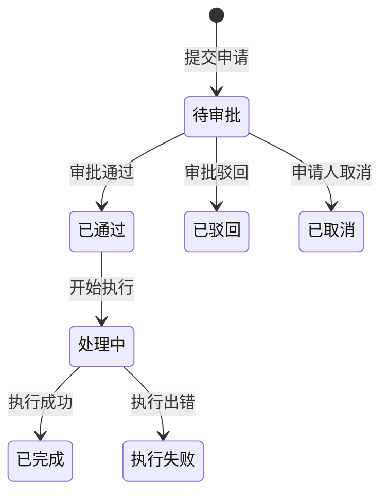

# ES Monitor Web 产品文档

## 文档迭代历史

| 版本 | 日期 | 更新内容 | 关键点 |
|------|------|----------|--------|
| v1.0 | 2026-01-11 | 初始版本创建 | 完整的产品功能文档，包含功能模块详解、使用说明书、需求迭代记录（迭代1-12） |
| v1.1 | 2026-01-13 | 后端服务迭代记录 | 新增迭代13-17记录，涵盖后端服务创建、前端API对接、Bug修复、性能优化等 |

---

## 1. 产品概述

ES Monitor Web 是一款专为 Elasticsearch 集群设计的监控管理平台，提供全方位的集群监控、智能告警、审批流程和自动化操作流功能。

### 1.1 产品定位

- **目标用户**：运维工程师、DBA、开发人员
- **核心价值**：简化 ES 集群管理，提升运维效率，降低操作风险
- **产品形态**：Web 应用

### 1.2 功能架构

```
┌─────────────────────────────────────────────────────────────┐
│                    ES Monitor Web                            │
├─────────────┬─────────────┬─────────────┬──────────────────┤
│   监控模块   │   告警模块   │   审批模块   │    管理模块      │
├─────────────┼─────────────┼─────────────┼──────────────────┤
│ • 监控概览   │ • 告警中心   │ • 审批列表   │ • 索引管理       │
│ • 集群信息   │ • 告警规则   │ • 提交审批   │ • 操作流管理     │
│ • 节点管理   │ • 告警记录   │ • 审批详情   │ • 开发控制台     │
│ • 索引列表   │ • 通知渠道   │             │ • 分析器测试     │
└─────────────┴─────────────┴─────────────┴──────────────────┘
```

---

## 2. 功能模块详解

### 2.1 监控模块

#### 2.1.1 监控概览

**功能描述**：展示集群整体健康状态和关键指标的仪表盘。

**页面路径**：`/` (首页)

**功能点**：

| 功能 | 说明 |
|------|------|
| 集群状态卡片 | 显示集群名称、状态（green/yellow/red）、版本 |
| 节点统计 | 总节点数、数据节点数、主节点数 |
| 索引统计 | 索引总数、文档数、存储大小 |
| 分片统计 | 总分片、主分片、未分配分片、迁移中分片 |
| JVM 内存 | 堆内存使用率、已用/最大内存 |
| 系统资源 | CPU 使用率、内存使用率 |
| 磁盘空间 | 总容量、可用空间、使用率 |

**界面示意**：
```
┌──────────────────────────────────────────────────────────┐
│  集群状态: ● green    节点: 3    索引: 15    文档: 12.5M  │
├──────────────────────────────────────────────────────────┤
│  ┌─────────┐  ┌─────────┐  ┌─────────┐  ┌─────────┐     │
│  │ JVM堆   │  │  CPU    │  │  内存   │  │  磁盘   │     │
│  │  55%    │  │  15%    │  │  60%    │  │  45%    │     │
│  └─────────┘  └─────────┘  └─────────┘  └─────────┘     │
└──────────────────────────────────────────────────────────┘
```

#### 2.1.2 集群信息

**功能描述**：展示集群详细配置和统计信息。

**页面路径**：`/cluster`

**功能点**：
- 集群基本信息（名称、UUID、版本）
- 节点分布统计
- 索引统计详情
- 分片分布情况
- JVM 版本信息
- 操作系统信息
- 插件列表

#### 2.1.3 节点管理

**功能描述**：展示所有节点列表及其状态。

**页面路径**：`/nodes`

**功能点**：
| 功能 | 说明 |
|------|------|
| 节点列表 | 表格展示所有节点 |
| 节点信息 | 名称、IP、角色、版本 |
| 资源指标 | CPU、内存、磁盘使用率 |
| 主节点标识 | 星标显示当前主节点 |
| 详情跳转 | 点击进入节点详情页 |

**节点角色说明**：
- `master` - 主节点，负责集群管理
- `data` - 数据节点，存储数据
- `ingest` - 摄取节点，数据预处理
- `ml` - 机器学习节点
- `coordinating_only` - 协调节点

#### 2.1.4 节点详情

**功能描述**：单个节点的详细监控信息和性能图表。

**页面路径**：`/nodes/:id`

**功能点**：

| 功能 | 说明 |
|------|------|
| 基本信息 | 节点名称、IP、版本、角色 |
| 时间范围选择 | 支持 15分钟/1小时/6小时/24小时/7天 |
| CPU 图表 | CPU 使用率时序图 |
| JVM 堆内存图表 | 堆内存使用率时序图 |
| 磁盘使用图表 | 磁盘使用率时序图 |
| 搜索性能图表 | 搜索 QPS 时序图 |
| 索引性能图表 | 索引写入速率时序图 |
| GC 统计图表 | Young/Old GC 次数时序图 |
| 线程池状态 | 各线程池队列、活跃、拒绝数 |
| 断路器状态 | 各断路器限制、估算、触发次数 |

**时间范围选择器**：
```
┌─────────────────────────────────────────┐
│  时间范围: [15分钟 ▼]                    │
│  选项: 15分钟 | 1小时 | 6小时 | 24小时 | 7天 │
└─────────────────────────────────────────┘
```

#### 2.1.5 索引列表

**功能描述**：展示所有索引及其状态。

**页面路径**：`/indices`

**功能点**：
| 功能 | 说明 |
|------|------|
| 索引列表 | 表格展示所有索引 |
| 健康状态 | green/yellow/red 状态标识 |
| 基本信息 | 索引名、UUID、状态（open/close） |
| 分片配置 | 主分片数、副本数 |
| 数据统计 | 文档数、已删除文档数 |
| 存储大小 | 主分片大小、总大小 |
| 详情跳转 | 点击进入索引详情页 |

#### 2.1.6 索引详情

**功能描述**：单个索引的详细信息和性能图表。

**页面路径**：`/indices/:name`

**功能点**：
| 功能 | 说明 |
|------|------|
| 基本信息 | 索引名、UUID、创建时间 |
| 时间范围选择 | 同节点详情 |
| 文档数图表 | 文档数量变化时序图 |
| 存储大小图表 | 存储空间变化时序图 |
| 搜索性能图表 | 搜索 QPS 和延迟 |
| 索引性能图表 | 写入速率和延迟 |
| 索引设置 | JSON 格式展示设置 |
| 索引映射 | JSON 格式展示映射 |

---

### 2.2 告警模块

#### 2.2.1 告警中心

**功能描述**：告警概览仪表盘，展示告警统计和趋势。

**页面路径**：`/alerts`

**功能点**：

| 功能 | 说明 |
|------|------|
| 告警统计 | 总数、触发中、已恢复、已确认 |
| 级别分布 | 严重、警告、信息级别数量 |
| 告警趋势 | 24小时告警数量趋势图 |
| 最近告警 | 最近触发的告警列表 |
| 快捷操作 | 跳转到规则管理、记录查看 |

**告警级别说明**：
- 🔴 **严重 (critical)** - 需要立即处理
- 🟡 **警告 (warning)** - 需要关注
- 🔵 **信息 (info)** - 仅供参考

#### 2.2.2 告警规则

**功能描述**：配置和管理告警规则。

**页面路径**：`/alert-rules`

**功能点**：
| 功能 | 说明 |
|------|------|
| 规则列表 | 表格展示所有规则 |
| 新建规则 | 创建新的告警规则 |
| 编辑规则 | 修改已有规则 |
| 启用/禁用 | 开关控制规则状态 |
| 删除规则 | 删除不需要的规则 |
| 多条件支持 | 支持 AND/OR 逻辑组合 |

**规则配置项**：
```
┌─────────────────────────────────────────────────────────┐
│ 规则名称: [CPU 使用率过高                    ]          │
│ 描述:     [当节点 CPU 使用率超过 80% 时触发   ]          │
├─────────────────────────────────────────────────────────┤
│ 指标类型: [CPU 使用率 ▼]                                │
│ 条件:     [大于 ▼] [80] %                               │
│ 持续时间: [300] 秒                                      │
│ 告警级别: [警告 ▼]                                      │
│ 冷却时间: [600] 秒                                      │
├─────────────────────────────────────────────────────────┤
│ 通知渠道: ☑ 运维邮件组  ☑ 钉钉告警群  ☐ 站内通知       │
└─────────────────────────────────────────────────────────┘
```

**支持的指标类型**：
| 指标 | 说明 |
|------|------|
| cluster_health | 集群健康状态 |
| node_cpu | 节点 CPU 使用率 |
| node_heap | JVM 堆内存使用率 |
| node_disk | 磁盘使用率 |
| node_memory | 系统内存使用率 |
| search_latency | 搜索延迟 |
| indexing_latency | 索引延迟 |
| unassigned_shards | 未分配分片数 |
| thread_pool_rejected | 线程池拒绝数 |
| gc_time | GC 时间 |

**多条件规则示例**：
```
条件组合: AND
├─ 条件1: CPU 使用率 > 80%
├─ 条件2: 内存使用率 > 85%
└─ 条件3: 磁盘使用率 > 90%
```

#### 2.2.3 告警记录

**功能描述**：查看历史告警记录。

**页面路径**：`/alert-records`

**功能点**：

| 功能 | 说明 |
|------|------|
| 记录列表 | 表格展示告警历史 |
| 状态筛选 | 按触发中/已恢复/已确认筛选 |
| 级别筛选 | 按严重/警告/信息筛选 |
| 时间筛选 | 按时间范围筛选 |
| 持续时间 | 显示告警持续时长 |
| 确认操作 | 确认告警并记录处理人 |
| 跳转监控 | 跳转到相关节点/索引监控页 |
| 通知详情 | 查看通知发送记录 |

**告警记录字段**：
- 规则名称
- 告警级别
- 告警状态
- 触发值/阈值
- 目标（节点/索引）
- 触发时间
- 恢复时间
- 持续时间
- 通知发送状态

#### 2.2.4 通知渠道

**功能描述**：配置告警通知渠道。

**页面路径**：`/notification-channels`

**功能点**：
| 功能 | 说明 |
|------|------|
| 渠道列表 | 展示所有通知渠道 |
| 新建渠道 | 创建新的通知渠道 |
| 编辑渠道 | 修改渠道配置 |
| 启用/禁用 | 控制渠道状态 |
| 测试发送 | 发送测试消息验证配置 |
| 删除渠道 | 删除不需要的渠道 |

**支持的渠道类型**：

| 类型 | 配置项 |
|------|--------|
| 邮件 (email) | 收件人列表、SMTP 服务器、端口、用户名、密码、TLS |
| 钉钉 (dingtalk) | Webhook URL、签名密钥、@手机号、@所有人 |
| Webhook | URL、HTTP 方法、请求头、消息模板 |
| 短信 (sms) | 手机号列表、服务商、API Key |
| 站内信 (internal) | 用户ID列表、是否广播 |

---

### 2.3 审批模块

#### 2.3.1 审批列表

**功能描述**：查看和管理所有审批申请。

**页面路径**：`/approvals`

**功能点**：
| 功能 | 说明 |
|------|------|
| 申请列表 | 表格展示所有申请 |
| 状态筛选 | 待审批/已通过/已驳回/处理中/已完成 |
| 类型筛选 | 按申请类型筛选 |
| 提交申请 | 跳转到提交页面 |
| 查看详情 | 跳转到详情页面 |
| 快速审批 | 列表中直接通过/驳回 |

**审批状态流转**：


#### 2.3.2 提交审批

**功能描述**：提交新的审批申请。

**页面路径**：`/approvals/submit`

**功能点**：

| 功能 | 说明 |
|------|------|
| 选择类型 | 选择申请类型 |
| 填写信息 | 根据类型填写申请内容 |
| 选择优先级 | 低/普通/高/紧急 |
| 选择通知渠道 | 选择审批结果通知方式 |
| 关联操作流 | 显示绑定的操作流模板 |
| 提交申请 | 提交并进入审批流程 |

**支持的申请类型**：
| 类型 | 说明 | 需要填写 |
|------|------|----------|
| create_index | 新建索引 | 索引名、分片数、副本数、映射、设置 |
| delete_index | 删除索引 | 索引名、删除原因、是否备份 |
| update_mapping | 修改映射 | 索引名、新映射、修改原因 |
| update_settings | 修改设置 | 索引名、新设置、修改原因 |
| create_alias | 创建别名 | 别名、索引名、过滤条件 |
| delete_alias | 删除别名 | 别名、索引名 |
| update_alias | 修改别名 | 别名、新索引、旧索引 |
| create_template | 创建模板 | 模板名、索引模式、模板内容 |
| delete_template | 删除模板 | 模板名 |
| create_pipeline | 创建管道 | 管道名、描述、处理器配置 |
| delete_pipeline | 删除管道 | 管道名 |
| reindex | 重建索引 | 源索引、目标索引、脚本 |
| other | 其他操作 | 操作说明、详细内容 |

#### 2.3.3 审批详情

**功能描述**：查看审批详情并进行审批操作。

**页面路径**：`/approvals/:id`

**功能点**：
| 功能 | 说明 |
|------|------|
| 申请信息 | 类型、状态、申请人、部门、优先级、时间 |
| 申请内容 | JSON 格式展示申请详情 |
| 审批流程 | Steps 组件展示审批节点 |
| 审批日志 | Timeline 展示操作历史 |
| 通过操作 | 审批通过并填写意见 |
| 驳回操作 | 审批驳回并填写原因 |
| 操作流状态 | 显示关联操作流执行进度 |
| 执行详情 | 查看操作流每步执行结果 |

**审批流程节点**：
```
┌─────────────────────────────────────────────────────────┐
│  审批流程                                               │
│  ┌─────────┐    ┌─────────┐    ┌─────────┐            │
│  │ 技术评审 │ → │ DBA审批  │ → │ 执行操作 │            │
│  │  ✓ 通过  │    │  待处理  │    │  待执行  │            │
│  │  王五    │    │  DBA    │    │  system │            │
│  └─────────┘    └─────────┘    └─────────┘            │
└─────────────────────────────────────────────────────────┘
```

**操作流执行状态**：
```
┌─────────────────────────────────────────────────────────┐
│ ℹ️ 操作流 [索引映射变更] 执行中                          │
│ ████████████░░░░░░░░ 45%                               │
│ 当前步骤: 迁移数据                                      │
│                                        [查看执行详情]   │
└─────────────────────────────────────────────────────────┘
```

---

### 2.4 管理模块

#### 2.4.1 索引管理

**功能描述**：索引、别名、管道、模板的统一管理。

**页面路径**：`/index-manage`

**功能点**：

**索引管理 Tab**：
| 功能 | 说明 |
|------|------|
| 索引列表 | 展示所有索引 |
| 创建索引 | 新建索引（支持从已有索引复制） |
| 删除索引 | 删除选中索引 |
| 打开/关闭 | 控制索引状态 |
| 刷新 | 强制刷新索引 |
| 清空缓存 | 清除索引缓存 |

**别名管理 Tab**：

| 功能 | 说明 |
|------|------|
| 别名列表 | 展示所有别名 |
| 创建别名 | 为索引创建别名 |
| 删除别名 | 删除别名 |
| 切换索引 | 将别名切换到其他索引 |

**管道管理 Tab**：
| 功能 | 说明 |
|------|------|
| 管道列表 | 展示所有 Ingest Pipeline |
| 创建管道 | 新建管道 |
| 编辑管道 | 修改管道配置 |
| 删除管道 | 删除管道 |
| 测试管道 | 测试管道处理效果 |

**模板管理 Tab**：
| 功能 | 说明 |
|------|------|
| 模板列表 | 展示所有索引模板 |
| 创建模板 | 新建模板 |
| 编辑模板 | 修改模板配置 |
| 删除模板 | 删除模板 |

#### 2.4.2 操作流管理

**功能描述**：管理原子操作、操作流模板和执行实例。

**页面路径**：`/workflows`

**Tab 页说明**：

**操作流实例 Tab**：
| 功能 | 说明 |
|------|------|
| 实例列表 | 展示所有操作流实例 |
| 状态显示 | 草稿/待审批/执行中/已完成/失败 |
| 进度显示 | 进度条和步骤完成数 |
| 查看详情 | 查看执行步骤和结果 |
| 取消执行 | 取消正在执行的操作流 |
| 重试 | 重试失败的操作流 |
| 跳转审批 | 跳转到关联的审批详情 |

**操作流模板 Tab**：
| 功能 | 说明 |
|------|------|
| 模板列表 | 展示所有模板（内置+自定义） |
| 新建模板 | 创建自定义模板 |
| 编辑模板 | 修改自定义模板 |
| 删除模板 | 删除自定义模板 |
| 执行模板 | 基于模板创建实例并执行 |
| 绑定审批 | 绑定审批类型 |
| 展开步骤 | 查看模板包含的步骤 |

**内置操作流模板**：
| 模板名称 | 说明 | 绑定审批类型 |
|---------|------|-------------|
| 索引映射变更 | 读取配置→创建新索引→迁移数据→验证→切换别名→删除旧索引 | update_mapping |
| 新建业务索引 | 创建索引→创建别名→通知 | create_index |
| 别名切换 | 原子切换别名→通知 | update_alias |
| 索引数据迁移 | 备份→迁移→验证→通知 | reindex |
| 索引删除（含备份） | 备份→删除→通知 | delete_index |

**原子操作 Tab**：
| 功能 | 说明 |
|------|------|
| 操作列表 | 展示所有原子操作 |
| 新建操作 | 创建自定义原子操作 |
| 编辑操作 | 修改自定义操作 |
| 删除操作 | 删除自定义操作 |
| 查看详情 | 查看操作 API 配置 |

**原子操作配置**：
```
┌─────────────────────────────────────────────────────────┐
│ 操作名称: [创建索引                        ]            │
│ 操作类型: [create_index ▼]                              │
│ 描述:     [创建新的 Elasticsearch 索引      ]            │
├─────────────────────────────────────────────────────────┤
│ API 配置                                                │
│ HTTP方法: [PUT ▼]                                       │
│ API端点:  [/{{indexName}}                  ]            │
│ 请求体:                                                 │
│ ┌─────────────────────────────────────────────────────┐│
│ │{                                                    ││
│ │  "settings": {{settings}},                          ││
│ │  "mappings": {{mappings}}                           ││
│ │}                                                    ││
│ └─────────────────────────────────────────────────────┘│
└─────────────────────────────────────────────────────────┘
```

**执行历史 Tab**：

| 功能 | 说明 |
|------|------|
| 历史列表 | 展示所有执行记录 |
| 状态筛选 | 按执行状态筛选 |
| 触发方式 | 手动执行/审批触发 |
| 执行耗时 | 显示总执行时间 |
| 查看详情 | 查看执行步骤详情 |

#### 2.4.3 开发控制台

**功能描述**：类似 Kibana Dev Tools 的查询控制台。

**页面路径**：`/dev-tools`

**功能点**：
| 功能 | 说明 |
|------|------|
| 查询编辑器 | 编写 ES 查询语句 |
| 执行查询 | 发送请求到 ES |
| 结果展示 | JSON 格式展示响应 |
| 查询示例 | 100+ 分类查询示例 |
| 自定义模板 | 保存常用查询模板 |
| 复制到控制台 | 一键复制示例到编辑器 |

**查询示例分类**（13类，100+示例）：
| 分类 | 示例数 | 说明 |
|------|--------|------|
| 集群管理 | 8 | 集群健康、设置、统计 |
| 节点管理 | 6 | 节点信息、统计、热点线程 |
| 索引管理 | 12 | 创建、删除、设置、映射 |
| 文档操作 | 10 | CRUD、批量操作 |
| 搜索查询 | 15 | match、term、bool、聚合 |
| 聚合分析 | 12 | 桶聚合、指标聚合、管道聚合 |
| 别名管理 | 6 | 创建、删除、切换别名 |
| 模板管理 | 6 | 索引模板、组件模板 |
| 管道管理 | 6 | Ingest Pipeline |
| 快照备份 | 6 | 仓库、快照、恢复 |
| 任务管理 | 5 | 任务列表、取消任务 |
| 安全管理 | 5 | 用户、角色、权限 |
| 监控诊断 | 8 | 分片分配、段信息、慢日志 |

#### 2.4.4 分析器测试

**功能描述**：测试 ES 分析器效果。

**页面路径**：`/analyzer`

**功能点**：
| 功能 | 说明 |
|------|------|
| 选择分析器 | 选择内置或自定义分析器 |
| 输入文本 | 输入待分析的文本 |
| 执行分析 | 调用 _analyze API |
| 结果展示 | 展示分词结果 |
| Token 详情 | 显示每个 token 的位置、类型 |

---

## 3. 使用说明书

### 3.1 快速开始

#### 3.1.1 访问系统

1. 打开浏览器，访问系统地址
2. 系统默认显示监控概览页面
3. 左侧边栏可折叠，点击菜单图标切换

#### 3.1.2 查看集群状态

1. 首页即为监控概览
2. 查看集群状态卡片（green/yellow/red）
3. 查看各项资源使用率
4. 如有异常，点击相应模块查看详情

### 3.2 监控操作指南

#### 3.2.1 查看节点详情

```
操作步骤：
1. 点击左侧菜单 [监控] → [节点管理]
2. 在节点列表中找到目标节点
3. 点击节点名称进入详情页
4. 选择时间范围查看历史数据
5. 查看各项性能图表
```

#### 3.2.2 查看索引详情

```
操作步骤：
1. 点击左侧菜单 [监控] → [索引列表]
2. 在索引列表中找到目标索引
3. 点击索引名称进入详情页
4. 查看索引设置和映射
5. 查看性能图表
```

### 3.3 告警配置指南

#### 3.3.1 创建告警规则

```
操作步骤：
1. 点击左侧菜单 [告警] → [告警规则]
2. 点击 [新建规则] 按钮
3. 填写规则名称和描述
4. 选择监控指标类型
5. 设置阈值条件（支持多条件）
6. 设置持续时间和冷却时间
7. 选择告警级别
8. 选择通知渠道
9. 点击 [保存] 完成创建
```

#### 3.3.2 配置通知渠道

```
操作步骤：
1. 点击左侧菜单 [告警] → [通知渠道]
2. 点击 [新建渠道] 按钮
3. 选择渠道类型（邮件/钉钉/Webhook等）
4. 填写渠道配置信息
5. 点击 [测试] 验证配置
6. 点击 [保存] 完成创建
```

### 3.4 审批操作指南

#### 3.4.1 提交审批申请

```
操作步骤：
1. 点击左侧菜单 [审批] → [审批管理]
2. 点击 [提交申请] 按钮
3. 选择申请类型
4. 填写申请标题和说明
5. 根据类型填写具体内容
6. 选择优先级
7. 选择通知渠道
8. 查看关联的操作流（如有）
9. 点击 [提交] 完成申请
```

#### 3.4.2 审批处理

```
操作步骤：
1. 点击左侧菜单 [审批] → [审批管理]
2. 找到待审批的申请
3. 点击进入详情页
4. 查看申请信息和内容
5. 点击 [通过] 或 [驳回]
6. 填写审批意见
7. 确认提交
```

#### 3.4.3 查看操作流执行

```
操作步骤：
1. 在审批详情页查看操作流状态提示
2. 点击 [查看执行详情] 按钮
3. 在弹窗中查看每个步骤的执行状态
4. 查看执行结果和耗时
5. 如有失败，查看错误信息
```

### 3.5 操作流使用指南

#### 3.5.1 手动执行操作流

```
操作步骤：
1. 点击左侧菜单 [管理] → [操作流]
2. 切换到 [操作流模板] Tab
3. 找到要执行的模板
4. 点击 [执行] 按钮
5. 填写执行名称和变量
6. 点击 [立即执行]
7. 在实例列表查看执行进度
```

#### 3.5.2 创建自定义操作流

```
操作步骤：
1. 点击左侧菜单 [管理] → [操作流]
2. 切换到 [操作流模板] Tab
3. 点击 [新建模板] 按钮
4. 填写模板名称和描述
5. 选择分类
6. 添加执行步骤（选择原子操作）
7. 配置每个步骤的参数
8. 点击 [保存] 完成创建
```

#### 3.5.3 绑定审批类型

```
操作步骤：
1. 在操作流模板列表找到目标模板
2. 点击 [绑定] 图标按钮
3. 选择要绑定的审批类型
4. 点击 [保存]
5. 之后该类型审批通过后将自动触发此操作流
```

### 3.6 开发工具使用指南

#### 3.6.1 执行查询

```
操作步骤：
1. 点击左侧菜单 [开发工具] → [控制台]
2. 在左侧编辑器输入查询语句
3. 点击 [执行] 按钮或按 Ctrl+Enter
4. 在右侧查看响应结果
```

#### 3.6.2 使用查询示例

```
操作步骤：
1. 在控制台页面右侧查看示例列表
2. 展开分类查看具体示例
3. 点击 [到控制台执行] 按钮
4. 示例自动填入编辑器
5. 根据需要修改参数
6. 执行查询
```

---

## 4. 附录：需求迭代记录

本附录完整记录了项目从零到一的开发过程，包括每次对话中用户的原始需求和开发执行的具体步骤。

---

### 4.1 迭代1：项目初始化

**对话时间**：项目启动

**用户原始需求**：
> 创建一个 ES 监控 Web 项目，使用 React + TypeScript + Vite，集成 Ant Design 和 Tailwind CSS。需要实现监控概览、集群信息、节点管理、索引列表等基础功能。UI 默认使用中文，代码注释也使用中文。

**执行步骤**：
1. 使用 Vite 创建 React + TypeScript 项目
   ```bash
   npm create vite@latest es-monitor-web-kiro -- --template react-ts
   ```
2. 安装依赖包
   ```bash
   npm install antd @ant-design/icons react-router-dom echarts echarts-for-react lucide-react
   npm install -D tailwindcss postcss autoprefixer
   ```
3. 配置 Tailwind CSS
   - 创建 `tailwind.config.js`
   - 创建 `postcss.config.js`
   - 在 `index.css` 中引入 Tailwind 指令
4. 配置路径别名
   - 修改 `vite.config.ts` 添加 `@` 别名
   - 修改 `tsconfig.json` 添加 paths 配置
5. 创建类型定义文件 `src/types/elasticsearch.ts`
   - 定义 ClusterHealth、ClusterStats 接口
   - 定义 NodeStats、NodeRole 类型
   - 定义 IndexInfo、IndexStats 接口
   - 基于 Elasticsearch 9.0 和 Metricbeat 数据结构
6. 创建 Mock 数据服务 `src/services/mockData.ts`
   - 实现 generateClusterHealth() 函数
   - 实现 generateClusterStats() 函数
   - 实现 generateNodeStats() 函数
   - 实现 generateIndexList() 函数
7. 创建布局组件 `src/layouts/MainLayout.tsx`
   - 类 Kibana 风格侧边栏
   - 深色侧边栏 + 浅色内容区
   - 顶部工具栏（刷新、设置）
8. 创建页面组件
   - `src/pages/Overview/index.tsx` - 监控概览
   - `src/pages/Cluster/index.tsx` - 集群信息
   - `src/pages/Nodes/index.tsx` - 节点列表
   - `src/pages/Indices/index.tsx` - 索引列表
9. 配置路由 `src/App.tsx`
10. 配置 Ant Design 中文语言包

**产出文件**：
- `es-monitor-web-kiro/` 完整项目结构
- `src/types/elasticsearch.ts` (约 800 行类型定义)
- `src/services/mockData.ts` (约 500 行 Mock 数据)
- 4 个页面组件

---

### 4.2 迭代2：图表和时间范围

**对话时间**：迭代1完成后

**用户原始需求**：
> 节点详情和索引详情需要增加性能监控图表，支持时间范围选择。图表要能正确显示时间轴，根据选择的时间范围动态调整。

**执行步骤**：
1. 创建时间范围选择器组件 `src/components/TimeRangeSelector.tsx`
   - 支持 15分钟、1小时、6小时、24小时、7天
   - 使用 Ant Design Select 组件
   - 导出时间范围常量
2. 创建指标图表组件 `src/components/MetricChart.tsx`
   - 基于 ECharts 封装
   - 支持时序数据展示
   - 自动格式化时间轴
   - 支持自定义颜色和单位
3. 扩展 Mock 数据服务
   - 添加 generateTimeSeries() 函数
   - 支持根据时间范围生成数据点
   - 根据指标类型生成合理的基准值和波动
4. 创建节点详情页 `src/pages/NodeDetail/index.tsx`
   - 基本信息展示（名称、IP、版本、角色）
   - CPU 使用率图表
   - JVM 堆内存图表
   - 磁盘使用率图表
   - 搜索性能图表
   - 索引性能图表
   - GC 统计图表
   - 线程池状态表格
   - 断路器状态表格
5. 创建索引详情页 `src/pages/IndexDetail/index.tsx`
   - 基本信息展示
   - 文档数变化图表
   - 存储大小图表
   - 搜索性能图表
   - 索引性能图表
   - 索引设置 JSON 展示
   - 索引映射 JSON 展示
6. 修复时间轴显示问题
   - 调整 ECharts xAxis 配置
   - 根据时间范围自动计算合适的数据点间隔

**产出文件**：
- `src/components/TimeRangeSelector.tsx`
- `src/components/MetricChart.tsx`
- `src/pages/NodeDetail/index.tsx`
- `src/pages/IndexDetail/index.tsx`
- 更新 `src/services/mockData.ts`

---

### 4.3 迭代3：页面重构和管理功能

**对话时间**：迭代2完成后

**用户原始需求**：
> 节点详情和索引详情应该是独立的页面，不是抽屉。另外需要增加类似 Kibana 的管理功能，包括开发控制台（Dev Tools）、索引管理、分析器测试等。

**执行步骤**：
1. 重构节点详情为独立页面
   - 修改路由配置 `/nodes/:id`
   - 添加返回按钮导航
   - 从 Drawer 改为独立 Page
2. 重构索引详情为独立页面
   - 修改路由配置 `/indices/:name`
   - 添加返回按钮导航
3. 创建开发控制台 `src/pages/DevTools/index.tsx`
   - 左侧查询编辑器（Monaco Editor 风格）
   - 右侧结果展示区
   - 执行按钮
   - 基础查询示例
4. 创建索引管理页 `src/pages/IndexManage/index.tsx`
   - 索引列表展示
   - 创建索引功能
   - 删除索引功能
   - 打开/关闭索引
5. 创建分析器测试页 `src/pages/Analyzer/index.tsx`
   - 分析器选择
   - 文本输入
   - 分词结果展示
6. 更新主布局菜单 `src/layouts/MainLayout.tsx`
   - 添加"管理"菜单组
   - 添加"开发工具"菜单组
   - 调整菜单结构

**产出文件**：
- `src/pages/DevTools/index.tsx`
- `src/pages/IndexManage/index.tsx`
- `src/pages/Analyzer/index.tsx`
- 更新 `src/App.tsx` 路由配置
- 更新 `src/layouts/MainLayout.tsx`

---

### 4.4 迭代4：告警模块

**对话时间**：迭代3完成后

**用户原始需求**：
> 需要增加告警监控模块，包括：
> 1. 告警规则配置 - 支持配置各种指标的告警阈值
> 2. 告警记录展示 - 查看历史告警
> 3. 通知渠道管理 - 支持邮件、钉钉、Webhook、短信、站内信等多种通知方式

**执行步骤**：
1. 扩展类型定义 `src/types/elasticsearch.ts`
   - 添加 AlertSeverity 类型（critical/warning/info）
   - 添加 AlertStatus 类型（firing/resolved/acknowledged）
   - 添加 AlertMetricType 类型（13种指标）
   - 添加 AlertOperator 类型（gt/gte/lt/lte/eq/neq）
   - 添加 AlertRule 接口
   - 添加 AlertRecord 接口
   - 添加 NotificationChannel 接口
   - 添加各渠道配置接口（Email/Dingtalk/Webhook/Sms/Internal）
2. 创建告警 Mock 数据 `src/services/alertMockData.ts`
   - mockAlertRules - 7条示例规则
   - mockAlertRecords - 5条示例记录
   - mockNotificationChannels - 4个示例渠道
   - generateAlertStatistics() 函数
   - 各种名称映射常量
3. 创建告警中心页 `src/pages/Alerts/index.tsx`
   - 告警统计卡片（总数、触发中、已恢复、已确认）
   - 级别分布统计
   - 24小时趋势图
   - 最近告警列表
4. 创建告警规则页 `src/pages/AlertRules/index.tsx`
   - 规则列表表格
   - 新建/编辑规则弹窗
   - 启用/禁用开关
   - 删除确认
5. 创建告警记录页 `src/pages/AlertRecords/index.tsx`
   - 记录列表表格
   - 状态/级别筛选
   - 确认操作
   - 通知发送详情
6. 创建通知渠道页 `src/pages/NotificationChannels/index.tsx`
   - 渠道列表
   - 新建/编辑渠道弹窗
   - 根据类型动态表单
   - 测试发送功能
7. 更新路由和菜单
   - 添加告警菜单组
   - 配置4个告警相关路由

**产出文件**：
- `src/types/elasticsearch.ts` (新增约 200 行)
- `src/services/alertMockData.ts` (约 300 行)
- `src/pages/Alerts/index.tsx`
- `src/pages/AlertRules/index.tsx`
- `src/pages/AlertRecords/index.tsx`
- `src/pages/NotificationChannels/index.tsx`

---

### 4.5 迭代5：审批模块

**对话时间**：迭代4完成后

**用户原始需求**：
> 需要增加审批流程模块，用于管理 ES 操作的审批。包括：
> 1. 审批列表 - 查看所有审批申请
> 2. 提交审批 - 提交新的操作申请
> 3. 审批详情 - 查看详情并进行审批操作
> 4. 审批流程节点展示
> 5. 审批日志记录
> 6. 集成告警模块的通知渠道

**执行步骤**：
1. 扩展类型定义 `src/types/elasticsearch.ts`
   - 添加 ApprovalRequestType 类型（13种申请类型）
   - 添加 ApprovalStatus 类型（7种状态）
   - 添加 ApprovalNodeStatus 类型
   - 添加 ApprovalNode 接口（审批节点）
   - 添加 ApprovalLog 接口（审批日志）
   - 添加 ApprovalRequest 接口
   - 添加各种 ApprovalContent 接口（不同类型的申请内容）
2. 创建审批 Mock 数据 `src/services/approvalMockData.ts`
   - mockApprovalRequests - 5条示例申请
   - APPROVAL_TYPE_NAMES 映射
   - APPROVAL_STATUS_NAMES 映射
   - APPROVAL_PRIORITY_NAMES 映射
   - generateApprovalStatistics() 函数
3. 创建审批列表页 `src/pages/ApprovalList/index.tsx`
   - 申请列表表格
   - 状态/类型筛选
   - 提交申请按钮
   - 查看详情跳转
4. 创建提交审批页 `src/pages/ApprovalSubmit/index.tsx`
   - 申请类型选择
   - 动态表单（根据类型显示不同字段）
   - 优先级选择
   - 通知渠道选择（复用告警模块）
5. 创建审批详情页 `src/pages/ApprovalDetail/index.tsx`
   - 申请信息展示
   - 申请内容 JSON 预览
   - 审批流程 Steps 组件
   - 审批日志 Timeline 组件
   - 通过/驳回操作按钮
   - 审批意见输入
6. 更新路由和菜单
   - 添加审批菜单组
   - 配置3个审批相关路由

**产出文件**：
- `src/types/elasticsearch.ts` (新增约 150 行)
- `src/services/approvalMockData.ts` (约 200 行)
- `src/pages/ApprovalList/index.tsx`
- `src/pages/ApprovalSubmit/index.tsx`
- `src/pages/ApprovalDetail/index.tsx`

---

### 4.6 迭代6：DevTools 增强

**对话时间**：迭代5完成后

**用户原始需求**：
> 开发控制台需要增加更多的查询示例，要覆盖 ES 的各种常用操作。另外复制按钮的文案改成"到控制台执行"，点击后直接把示例填入编辑器。还需要支持用户保存自定义的查询模板。

**执行步骤**：
1. 扩展查询示例 `src/pages/DevTools/index.tsx`
   - 集群管理（8个示例）
     - 集群健康、集群设置、集群统计、分片分配解释等
   - 节点管理（6个示例）
     - 节点信息、节点统计、热点线程等
   - 索引管理（12个示例）
     - 创建索引、删除索引、索引设置、映射管理等
   - 文档操作（10个示例）
     - 索引文档、获取文档、更新文档、删除文档、批量操作等
   - 搜索查询（15个示例）
     - match、term、bool、range、聚合查询等
   - 聚合分析（12个示例）
     - terms、histogram、date_histogram、avg、sum、管道聚合等
   - 别名管理（6个示例）
   - 模板管理（6个示例）
   - 管道管理（6个示例）
   - 快照备份（6个示例）
   - 任务管理（5个示例）
   - 安全管理（5个示例）
   - 监控诊断（8个示例）
2. 修改复制按钮
   - 文案改为"到控制台执行"
   - 点击后将示例内容填入左侧编辑器
   - 自动滚动到编辑器顶部
3. 添加自定义模板功能
   - 新建模板按钮
   - 模板名称和内容输入
   - 保存到 localStorage
   - 模板列表展示
   - 编辑/删除模板
   - 模板分类展示在示例列表中

**产出文件**：
- 更新 `src/pages/DevTools/index.tsx` (约 800 行，包含 100+ 示例)

---

### 4.7 迭代7：综合增强（第一部分）

**对话时间**：迭代6完成后

**用户原始需求**：
> 需要对多个模块进行增强：
> 1. 侧边栏菜单需要支持二级菜单折叠展开
> 2. 告警规则需要支持多条件组合，支持 AND/OR 逻辑
> 3. 告警记录需要显示告警持续时间，并且可以跳转到对应的节点或索引监控页面
> 4. 索引管理需要支持从已有索引复制创建新索引，还需要增加别名管理、管道管理、模板管理的 Tab

**执行步骤**：
1. 重构侧边栏菜单 `src/layouts/MainLayout.tsx`
   - 使用 Ant Design Menu 的 SubMenu 组件
   - 配置 menuItems 为嵌套结构
   - 监控、告警、审批、管理、开发工具 5 个一级菜单
   - 每个一级菜单下有对应的二级菜单项
   - 支持展开/收起状态记忆
   - 根据当前路由自动展开对应菜单
2. 增强告警规则 `src/pages/AlertRules/index.tsx`
   - 添加条件组合逻辑选择（AND/OR）
   - 支持添加多个条件
   - 每个条件独立配置指标、操作符、阈值
   - 条件列表动态增删
   - 表单验证
3. 增强告警记录 `src/pages/AlertRecords/index.tsx`
   - 添加持续时间列
   - 计算 firedAt 到 resolvedAt 的时长
   - 格式化显示（秒/分钟/小时）
   - 添加"跳转监控"按钮
   - 根据 target 类型跳转到节点或索引详情页
4. 增强索引管理 `src/pages/IndexManage/index.tsx`
   - 添加 Tabs 组件（索引、别名、管道、模板）
   - 索引 Tab：
     - 创建索引支持"从已有索引复制"
     - 选择源索引后自动填充设置和映射
   - 别名 Tab：
     - 别名列表
     - 创建别名（选择索引、输入别名、可选过滤条件）
     - 删除别名
     - 切换别名指向的索引
   - 管道 Tab：
     - 管道列表
     - 创建/编辑管道
     - 处理器配置
     - 删除管道
   - 模板 Tab：
     - 模板列表
     - 创建/编辑模板
     - 索引模式配置
     - 删除模板

**产出文件**：
- 更新 `src/layouts/MainLayout.tsx`
- 更新 `src/pages/AlertRules/index.tsx`
- 更新 `src/pages/AlertRecords/index.tsx`
- 更新 `src/pages/IndexManage/index.tsx`

---

### 4.8 迭代8：操作流模块

**对话时间**：迭代7完成后

**用户原始需求**：
> 操作流那里还需要细化一下：
> 1. 操作流是由一个个原子操作组成的，由管理人员添加，比如更改索引并切换（涉及如下操作：读取已有索引，填入具体修改后创建新索引，reindex旧索引数据到新索引）。
> 2. 用户提交审批的类型，可以和操作流进行关联（在审批流管理列表或者新建/修改时绑定）。
> 3. 用户提交后，管理人员进行审批，审批完成之后，自动执行操作流中的操作，并且实时展示进度，每一个节点都需要记录操作结果并且展示。
> 4. 系统的整体UI，尤其是title处，颜色和字体需要优化，现在颜色接近看不清楚。

**执行步骤**：
1. 扩展类型定义 `src/types/elasticsearch.ts`
   - 添加 AtomicOperationType 类型（13种原子操作）
   - 添加 HttpMethod 类型
   - 添加 WorkflowStepType 类型
   - 添加 WorkflowStepStatus 类型
   - 添加 WorkflowStatus 类型
   - 添加 WorkflowStepResult 接口
   - 添加 WorkflowStep 接口
   - 添加 AtomicOperationApiConfig 接口
   - 添加 AtomicOperation 接口
   - 添加 WorkflowTemplate 接口
   - 添加 WorkflowInstance 接口
   - 添加 WorkflowExecutionRecord 接口
2. 创建操作流 Mock 数据 `src/services/workflowMockData.ts`
   - atomicOperations - 11个内置原子操作
   - builtinWorkflowTemplates - 5个内置模板
   - mockWorkflowInstances - 4个示例实例
   - mockExecutionRecords - 执行记录
   - 各种名称映射常量
   - APPROVAL_WORKFLOW_BINDINGS - 审批类型与操作流绑定关系
3. 创建操作流管理页 `src/pages/Workflows/index.tsx`
   - 4个 Tab：实例、模板、原子操作、执行历史
   - 操作流实例列表
     - 状态、进度、触发方式展示
     - 查看详情弹窗
     - 取消/重试操作
   - 操作流模板列表
     - 内置/自定义标识
     - 展开查看步骤
     - 执行按钮
     - 绑定审批类型
   - 原子操作列表
     - API 配置展示
     - 新建/编辑/删除
   - 执行历史列表
     - 筛选功能
     - 耗时统计
4. 更新审批提交页 `src/pages/ApprovalSubmit/index.tsx`
   - 根据选择的申请类型查询绑定的操作流
   - 显示关联的操作流模板信息
   - 提示审批通过后将自动执行
5. 更新审批详情页 `src/pages/ApprovalDetail/index.tsx`
   - 查询关联的操作流实例
   - 显示操作流执行状态 Alert
   - 显示执行进度条
   - 查看执行详情弹窗
   - 每个步骤的状态、结果、耗时
6. 优化 UI 标题颜色
   - 所有页面标题使用 `text-gray-900`
   - 表格列标题优化
   - 卡片标题优化

**产出文件**：
- `src/types/elasticsearch.ts` (新增约 150 行)
- `src/services/workflowMockData.ts` (约 350 行)
- `src/pages/Workflows/index.tsx` (约 600 行)
- 更新 `src/pages/ApprovalSubmit/index.tsx`
- 更新 `src/pages/ApprovalDetail/index.tsx`
- 更新多个页面的标题颜色

---

### 4.9 迭代9：操作流细化

**对话时间**：迭代8完成后

**用户原始需求**：
> 操作流那里还是要继续细化：
> 1. 原子操作支持新增和编辑，一个操作实际就是一次kibana/es的接口请求，配置内容就是和调用api一样，完善原子操作的增删改查。
> 2. 操作流的新建功能还没有实现，支持按照原子操作进行操作流的构建。
> 3. 审批管理中还没有和操作流进行有效结合。如果提交审批时选择了操作流（申请审批的操作类型和操作流可以进行绑定）。如果提交审批选择了操作流，审批通过时，应该自动执行操作流，并且在审批流中要体现，操作流执行中。
> 4. 审批详情界面增加一个操作流执行步骤（具体可以点击进去查看当前操作流执行过程，每一个操作流节点的执行结果，状态等等。
> 5. 操作流模块也要有一个执行历史的列表，对应操作流的执行记录，支持筛选操作。
> 完善这两块的交互以及整个提交申请-审批-自动执行操作流的一整个流程。确保能够正常进行。

**执行步骤**：
1. 完善原子操作 CRUD `src/pages/Workflows/index.tsx`
   - 新建原子操作弹窗
     - 操作名称输入
     - 操作类型选择
     - 描述输入
     - API 配置区域
       - HTTP 方法选择（GET/POST/PUT/DELETE/HEAD）
       - API 端点输入（支持变量 {{indexName}}）
       - 请求体 JSON 编辑器
   - 编辑原子操作
     - 内置操作只读查看
     - 自定义操作可编辑
   - 删除原子操作
     - 内置操作不可删除
     - 删除确认弹窗
2. 实现操作流模板新建 `src/pages/Workflows/index.tsx`
   - 新建模板弹窗
     - 模板名称输入
     - 分类选择（索引操作/别名操作/数据迁移/自定义）
     - 描述输入
     - 步骤配置区域
       - 动态添加/删除步骤
       - 每个步骤选择原子操作类型
       - 步骤名称和描述
       - 步骤排序
   - 编辑模板
   - 删除模板（内置不可删除）
3. 完善审批-操作流集成
   - ApprovalSubmit 页面
     - 选择申请类型后查询绑定的操作流
     - Alert 提示关联的操作流
   - ApprovalDetail 页面
     - 审批通过时自动创建操作流实例
     - 显示操作流执行状态 Alert
     - 进度条实时显示
     - 当前执行步骤提示
     - "查看执行详情"按钮
   - 操作流执行详情弹窗
     - 基本信息（名称、状态、模板、进度）
     - 步骤 Timeline
     - 每个步骤的状态图标
     - 执行结果消息
     - 错误信息（如有）
     - 执行耗时
4. 完善执行历史 Tab
   - 执行记录列表
   - 状态筛选
   - 触发方式筛选（手动/审批触发）
   - 执行人
   - 开始时间
   - 总耗时
   - 查看详情

**产出文件**：
- 更新 `src/pages/Workflows/index.tsx` (约 600 行)
- 更新 `src/pages/ApprovalSubmit/index.tsx`
- 更新 `src/pages/ApprovalDetail/index.tsx`
- 更新 `src/services/workflowMockData.ts`

---

### 4.10 迭代10：GitHub 上传

**对话时间**：迭代9完成后

**用户原始需求**：
> 把项目上传到github，地址是 https://github.com/yjc1972077620/es-manage.git

**执行步骤**：
1. 初始化 Git 仓库
   ```bash
   cd es-monitor-web-kiro
   git init
   ```
2. 配置 .gitignore
   - node_modules/
   - dist/
   - .env
   - *.log
3. 添加所有文件
   ```bash
   git add .
   ```
4. 创建初始提交
   ```bash
   git commit -m "Initial commit: ES Monitor Web"
   ```
5. 添加远程仓库
   ```bash
   git remote add origin https://github.com/yjc1972077620/es-manage.git
   ```
6. 推送到 GitHub（首次推送遇到冲突，使用 force push）
   ```bash
   git push --force origin main
   ```

**产出**：
- 项目成功推送到 https://github.com/yjc1972077620/es-manage.git

---

### 4.11 迭代11：文档生成

**对话时间**：迭代10完成后

**用户原始需求**：
> 选择我需要你生成一份当前项目的文档说明。包括三种不同受众，都需要有详细的文本以及图例。
> 1. 面向技术委员会，详细介绍项目的技术栈，业务流程，字段定义，架构设计，已经实现的功能，后续优化方向等等。
> 2. 面向产品。详细说明项目每一个功能点，具体流程，分模块进行介绍，流程要清晰，详细，全面，1：1还原细节。同时，增加项目使用说明书，详细介绍使用流程，按照功能点进行处理。最后，要记录我和你不断完善需求的对话，以及每次修改的地方，这个作为文档的附录记录到最后面。
> 3. 面向开发。介绍具体功能，每个模块的业务流程，涉及的数据结构，mock数据的定义与使用，模拟的接口定义，各个功能点所需要的入参，出参，界面功能点的接口调用等等。
> 要求：中文编写，流程图要详细，整体逻辑清晰，涉及功能全面不遗漏。

**执行步骤**：
1. 读取项目关键文件
   - `src/types/elasticsearch.ts` - 所有类型定义
   - `src/services/mockData.ts` - 监控 Mock 数据
   - `src/services/alertMockData.ts` - 告警 Mock 数据
   - `src/services/approvalMockData.ts` - 审批 Mock 数据
   - `src/services/workflowMockData.ts` - 操作流 Mock 数据
   - `src/App.tsx` - 路由配置
   - `src/layouts/MainLayout.tsx` - 布局和菜单
   - 各页面组件
2. 创建 `docs/` 目录
3. 编写技术委员会文档 `docs/技术委员会文档.md`
   - 项目概述
   - 技术栈详解
   - 架构设计（含 Mermaid 图）
   - 目录结构
   - 核心类型定义
   - 业务流程图
   - 已实现功能清单
   - 后续优化方向
4. 编写产品文档 `docs/产品文档.md`
   - 产品概述
   - 功能模块详解（监控、告警、审批、管理）
   - 每个页面的功能点说明
   - 使用说明书
   - 需求迭代记录（附录）
5. 编写开发文档 `docs/开发文档.md`
   - 项目结构
   - 路由配置
   - 数据结构定义（TypeScript 接口）
   - Mock 数据服务说明
   - 页面组件接口
   - 通用组件 Props
   - 业务流程图
   - 开发指南

**产出文件**：
- `docs/技术委员会文档.md`
- `docs/产品文档.md`
- `docs/开发文档.md`

---

### 4.12 迭代12：文档完善

**对话时间**：迭代11完成后

**用户原始需求**：
> 更新产品文档，最后的需求迭代记录，需要完全记录对话中我的内容，再加上每次对话你执行的步骤，形成更加详细的迭代过程。

**执行步骤**：
1. 读取现有产品文档
2. 重写附录"需求迭代记录"部分
   - 完整记录每次对话的用户原始需求（原文）
   - 详细列出每次迭代的执行步骤
   - 记录产出的文件列表
   - 按时间顺序组织

**产出文件**：
- 更新 `docs/产品文档.md` 附录部分

---

### 4.13 迭代13：后端服务创建（2026年1月12日）

**对话时间**：2026年1月12日

**用户原始需求**：
> 创建后端服务，连接 Kibana Monitoring API，替换前端 Mock 数据。

**执行步骤**：
1. 创建 Spring Boot 3.2 项目 `es-manage-service`
2. 配置 Kibana 连接信息
   - 地址：http://192.168.4.239:5601
   - 认证：elastic/123456
   - 集群 ID：rMzxGfB1TfibGYna-UIIzQ
3. 创建 KibanaClient HTTP 客户端
   - 使用 OkHttp 4.x
   - 配置必需请求头：kbn-version、kbn-build-number、x-elastic-internal-origin
4. 创建 DTO 类映射 Kibana API 返回数据
5. 创建 MonitorController 提供 REST API
6. 配置 CORS 允许前端跨域访问

**产出文件**：
- `es-manage-service/` 完整后端项目
- `src/main/java/com/esmanage/client/KibanaClient.java`
- `src/main/java/com/esmanage/dto/*.java`
- `src/main/java/com/esmanage/controller/MonitorController.java`

---

### 4.14 迭代14：前端对接真实 API（2026年1月12日）

**对话时间**：2026年1月12日

**用户原始需求**：
> 前端监控模块对接后端真实 API，替换 Mock 数据。

**执行步骤**：
1. 创建前端 API 服务 `src/services/kibanaApi.ts`
2. 更新监控页面使用真实 API
   - Overview - 监控概览
   - Cluster - 集群信息
   - Nodes - 节点列表
   - NodeDetail - 节点详情
   - Indices - 索引列表
   - IndexDetail - 索引详情
3. 使用 Promise.all 并行请求优化性能

**产出文件**：
- `es-manage/src/services/kibanaApi.ts`
- `es-manage/src/types/kibana.ts`
- 更新 `es-manage/src/pages/*/index.tsx`

---

### 4.15 迭代15：Bug 修复与交互优化（2026年1月12日）

**对话时间**：2026年1月12日

**用户原始需求**：
> 修复 IndexDetail 500 错误，修复 NodeDetail 图表不显示问题，优化时间范围选择器交互。

**执行步骤**：
1. 修复 IndexDetail 500 错误
   - `dataSize` 从 `Long` 改为对象 `{primaries, total}`
   - `ShardInfo.index` 从 `Integer` 改为 `String`
   - 新增 `ShardInfo.shard` 字段
2. 修复 NodeDetail 图表显示
   - 指标 key 从 `node_cpu_utilization` 改为 `node_cpu_metric`
   - 用 `node_total_io` 替换不存在的 `node_index_mem`
3. 优化 TimeRangeSelector
   - 添加 `loading` prop 显示刷新动画
   - 支持自动刷新功能

**产出文件**：
- 更新 `es-manage-service/src/main/java/com/esmanage/dto/IndexDetailDTO.java`
- 更新 `es-manage/src/components/TimeRangeSelector.tsx`
- 更新 `es-manage/src/pages/NodeDetail/index.tsx`

---

### 4.16 迭代16：API 性能优化（2026年1月12日）

**对话时间**：2026年1月12日

**用户原始需求**：
> 1. 优化接口速度，是不是每次查询都模拟了登录，登录信息应该做缓存的，减少重复时间损耗，另外，统计一下是哪些接口调用慢，方便做后续优化处理。
> 2. 优化前端的接口调用，统一使用promise进行，这样是不是能够优化速度。

**执行步骤**：
1. 后端优化
   - 移除不必要的登录逻辑，直接使用 Basic Auth
   - 增大连接池到 10 个连接，5 分钟保持
   - 添加 API 调用统计（调用次数、平均/最小/最大耗时）
   - 添加 `/api/monitor/stats` 端点查看统计
2. 确认前端已使用 Promise.all 并行请求

**产出文件**：
- 更新 `es-manage-service/src/main/java/com/esmanage/client/KibanaClient.java`
- 更新 `es-manage-service/src/main/java/com/esmanage/controller/MonitorController.java`

---

### 4.17 迭代17：文档更新（2026年1月12日）

**对话时间**：2026年1月12日

**用户原始需求**：
> 将今天的改动全部更新到文档中，尤其是数据结构部分，一切以kibana实际返回为准。并且在产品文档中同样详细的记录今天的需求迭代记录，不同日期增加表述。原则：只更新修改了的部分，其余逻辑不变。

**执行步骤**：
1. 更新开发文档
   - 添加后端服务章节（项目结构、配置、API 接口）
   - 添加 Kibana API 数据结构章节（基于实际返回）
   - 添加前端 API 服务章节
   - 保留原有 Mock 数据、类型定义、页面组件等内容
2. 更新产品文档
   - 添加迭代 4.13-4.17 记录（2026年1月12日）
3. 更新技术委员会文档
   - 更新项目架构信息

**产出文件**：
- 更新 `es-manage/docs/开发文档.md`
- 更新 `es-manage/docs/产品文档.md`
- 更新 `es-manage/docs/技术委员会文档.md`
