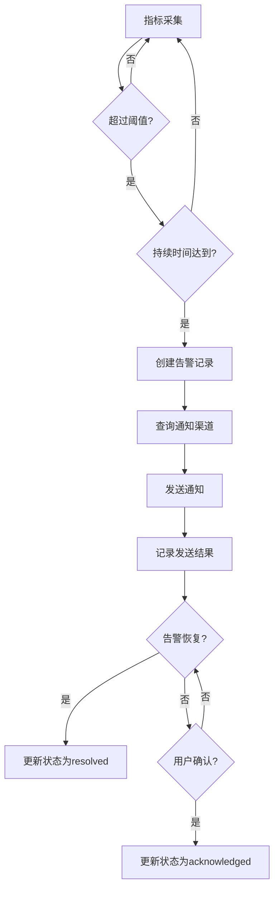
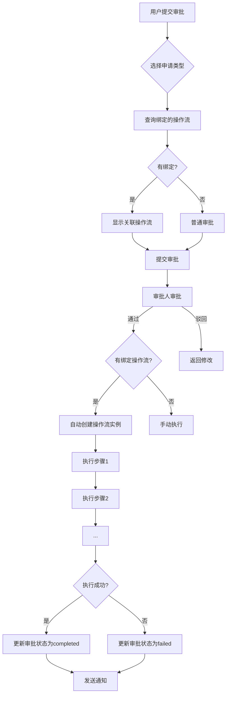
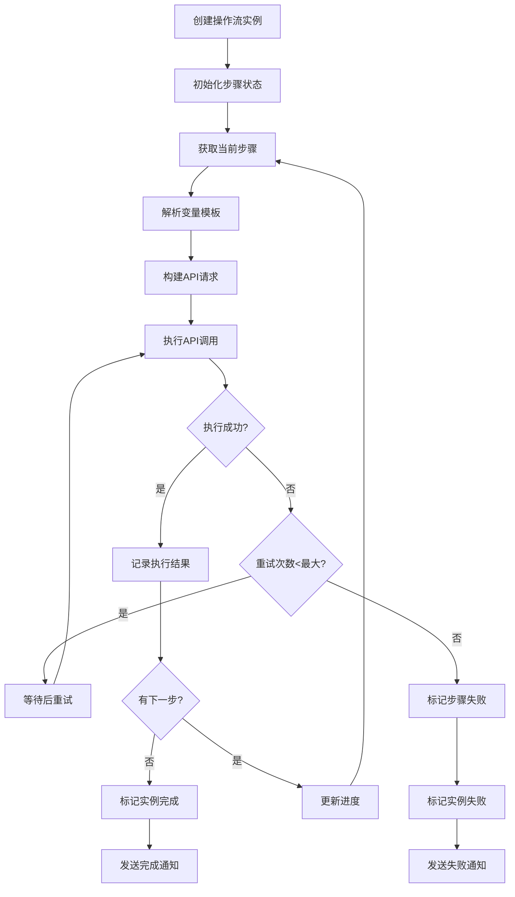

# ES Monitor Web 开发文档

## 文档迭代历史

| 版本 | 日期 | 更新内容 | 关键点 |
|------|------|----------|--------|
| v1.0 | 2026-01-11 | 初始版本创建 | 完整的前端开发文档，包含项目结构、类型定义、Mock数据、页面组件、通用组件、业务流程等 |
| v1.1 | 2026-01-13 | 后端服务集成 | 新增后端服务章节、Kibana API数据结构、前端API服务，监控模块从Mock切换到真实API |

---

## 1. 项目结构

### 1.1 目录说明

```
es-monitor-web-kiro/
├── src/
│   ├── components/          # 通用组件
│   ├── layouts/             # 布局组件
│   ├── pages/               # 页面组件
│   ├── services/            # 服务层（API调用/Mock数据）
│   ├── types/               # TypeScript 类型定义
│   ├── constants/           # 常量定义
│   ├── App.tsx              # 应用入口
│   └── main.tsx             # 渲染入口
├── public/                  # 静态资源
├── index.html               # HTML 模板
├── vite.config.ts           # Vite 配置
├── tailwind.config.js       # Tailwind 配置
├── tsconfig.json            # TypeScript 配置
└── package.json             # 项目配置
```

### 1.2 路由配置

**文件位置**：`src/App.tsx`

```typescript
<Routes>
  <Route path="/" element={<MainLayout />}>
    {/* 监控 */}
    <Route index element={<Overview />} />
    <Route path="cluster" element={<Cluster />} />
    <Route path="nodes" element={<Nodes />} />
    <Route path="nodes/:id" element={<NodeDetail />} />
    <Route path="indices" element={<Indices />} />
    <Route path="indices/:name" element={<IndexDetail />} />
    
    {/* 管理 */}
    <Route path="index-manage" element={<IndexManage />} />
    <Route path="workflows" element={<Workflows />} />
    
    {/* 告警 */}
    <Route path="alerts" element={<Alerts />} />
    <Route path="alert-rules" element={<AlertRules />} />
    <Route path="alert-records" element={<AlertRecords />} />
    <Route path="notification-channels" element={<NotificationChannels />} />
    
    {/* 审批 */}
    <Route path="approvals" element={<ApprovalList />} />
    <Route path="approvals/submit" element={<ApprovalSubmit />} />
    <Route path="approvals/:id" element={<ApprovalDetail />} />
    
    {/* 开发工具 */}
    <Route path="dev-tools" element={<DevTools />} />
    <Route path="analyzer" element={<Analyzer />} />
  </Route>
</Routes>
```

---

## 2. 后端服务 (es-manage-service)

### 2.1 项目概述

后端服务基于 Spring Boot 3.2 构建，作为前端与 Kibana Monitoring API 之间的代理层。

**技术栈**：
- Spring Boot 3.2
- Java 17
- OkHttp 4.x（HTTP 客户端）
- Lombok
- Gradle 构建

**运行方式**：
```bash
cd es-manage-service
./gradlew bootRun --console=plain
```

服务端口：8080

### 2.2 配置文件

**文件位置**：`src/main/resources/application.yml`

```yaml
server:
  port: 8080

kibana:
  base-url: http://192.168.4.239:5601
  username: elastic
  password: 123456
  cluster-id: rMzxGfB1TfibGYna-UIIzQ
  version: 8.18.0
  build-number: 82976
```

### 2.3 核心组件

#### KibanaClient - Kibana HTTP 客户端

**文件位置**：`src/main/java/com/esmanage/client/KibanaClient.java`

**功能**：
- 封装与 Kibana Monitoring API 的通信
- 使用 Basic Auth 认证（无需每次登录）
- 连接池复用（10个连接，5分钟保持）
- 接口调用统计（调用次数、平均/最小/最大耗时）

**关键配置**：
```java
// 连接池配置
.connectionPool(new ConnectionPool(10, 5, TimeUnit.MINUTES))

// 必需的请求头
.addHeader("kbn-version", "8.18.0")
.addHeader("kbn-build-number", "82976")
.addHeader("x-elastic-internal-origin", "Kibana")
```

### 2.4 API 接口

| 接口路径 | 方法 | 说明 |
|---------|------|------|
| `/api/monitor/overview` | POST | 获取监控概览 |
| `/api/monitor/cluster` | POST | 获取集群状态 |
| `/api/monitor/nodes` | POST | 获取节点列表 |
| `/api/monitor/nodes/{nodeId}` | POST | 获取节点详情 |
| `/api/monitor/indices` | POST | 获取索引列表 |
| `/api/monitor/indices/{indexName}` | POST | 获取索引详情 |
| `/api/monitor/stats` | GET | 获取API调用统计 |

**请求体格式**（时间范围）：
```json
{
  "timeRange": {
    "min": "2026-01-12T00:00:00.000Z",
    "max": "2026-01-12T23:59:59.999Z"
  }
}
```

---

## 3. Kibana API 数据结构

### 3.1 监控概览 (MonitoringOverviewDTO)

```java
public class MonitoringOverviewDTO {
    private ClusterInfo cluster;      // 集群信息
    private NodesInfo nodes;          // 节点统计
    private IndicesInfo indices;      // 索引统计
    private ShardsInfo shards;        // 分片统计
    private JvmInfo jvm;              // JVM 统计
    private OsInfo os;                // 操作系统统计
    private FsInfo fs;                // 文件系统统计
    private Map<String, List<TimeSeriesPointDTO>> timeSeries;  // 时序数据
}
```

### 3.2 集群状态 (ClusterStatusDTO)

```java
public class ClusterStatusDTO {
    private String status;            // 集群健康状态: green/yellow/red
    private Integer indicesCount;     // 索引总数
    private Long documentCount;       // 文档总数
    private Long dataSize;            // 数据大小（字节）
    private Integer nodesCount;       // 节点总数
    private Long upTime;              // 集群运行时间（毫秒）
    private List<String> version;     // ES 版本列表
    private Long memUsed;             // 已用内存（字节）
    private Long memMax;              // 最大内存（字节）
    private Integer unassignedShards; // 未分配分片数
    private Integer totalShards;      // 总分片数
}
```

### 3.3 节点详情 (NodeDetailDTO)

```java
public class NodeDetailDTO {
    private NodeSummary nodeSummary;                    // 节点摘要
    private Map<String, List<TimeSeriesDataDTO>> metrics;  // 指标时序数据
}

public class NodeSummary {
    private String name;              // 节点名称
    private String uuid;              // 节点 UUID
    private String transportAddress;  // 传输地址
    private String host;              // 主机名
    private String ip;                // IP 地址
    private String version;           // ES 版本
    private List<String> roles;       // 节点角色列表
    private Boolean isMaster;         // 是否是当前主节点
    private Boolean isOnline;         // 是否在线
    private Integer shardCount;       // 分片数量
    private String nodeTypeLabel;     // 节点类型标签
}
```

**可用的节点指标 (metrics key)**：
- `node_cpu_metric` - CPU 使用率（注意：不是 node_cpu_utilization）
- `node_jvm_mem` - JVM 堆内存使用率
- `node_total_io` - 总 I/O 操作（替代 node_index_mem）
- `node_latency` - 延迟
- `node_load_average` - 负载平均值
- `node_segment_count` - 段数量

### 3.4 索引详情 (IndexDetailDTO)

```java
public class IndexDetailDTO {
    private IndexSummary indexSummary;                  // 索引摘要
    private Map<String, List<TimeSeriesDataDTO>> metrics;  // 指标时序数据
    private List<ShardInfo> shards;                    // 分片信息
}

public class IndexSummary {
    private String name;              // 索引名称
    private String status;            // 健康状态
    private Integer primaries;        // 主分片数
    private Integer replicas;         // 副本数
    private Long documents;           // 文档数
    private DataSize dataSize;        // 数据大小（对象类型）
    private Integer unassignedShards; // 未分配分片数
    private Integer totalShards;      // 总分片数
}

// 重要：dataSize 是对象类型，不是 Long
public class DataSize {
    private Long primaries;           // 主分片大小（字节）
    private Long total;               // 总大小（字节）
}

public class ShardInfo {
    private String index;             // 分片所属索引名称（String 类型）
    private Integer shard;            // 分片编号（新增字段）
    private String node;              // 节点名称
    private Boolean primary;          // 是否主分片
    private String relocatingNode;    // 迁移节点
    private String state;             // 分片状态
}
```

### 3.5 时序数据 (TimeSeriesDataDTO)

```java
public class TimeSeriesDataDTO {
    private Long timestamp;           // 时间戳（毫秒）
    private Object data;              // 数据值（可能是数组 [timestamp, value]）
}
```

---

## 4. 前端数据结构定义

### 4.1 集群相关类型

**文件位置**：`src/types/elasticsearch.ts`

#### ClusterHealth - 集群健康信息

```typescript
interface ClusterHealth {
  cluster_name: string;           // 集群名称
  status: 'green' | 'yellow' | 'red';  // 健康状态
  timed_out: boolean;             // 是否超时
  number_of_nodes: number;        // 节点总数
  number_of_data_nodes: number;   // 数据节点数
  active_primary_shards: number;  // 活跃主分片数
  active_shards: number;          // 活跃分片总数
  relocating_shards: number;      // 迁移中分片数
  initializing_shards: number;    // 初始化中分片数
  unassigned_shards: number;      // 未分配分片数
  delayed_unassigned_shards: number;
  number_of_pending_tasks: number;
  number_of_in_flight_fetch: number;
  task_max_waiting_in_queue_millis: number;
  active_shards_percent_as_number: number;
}
```

#### ClusterStats - 集群统计信息

```typescript
interface ClusterStats {
  _nodes: { total: number; successful: number; failed: number };
  cluster_name: string;
  cluster_uuid: string;
  timestamp: number;
  status: ClusterHealthStatus;
  indices: ClusterIndicesStats;   // 索引统计
  nodes: ClusterNodesStats;       // 节点统计
}
```

### 4.2 节点相关类型

#### NodeStats - 节点统计信息

```typescript
interface NodeStats {
  name: string;                   // 节点名称
  transport_address: string;      // 传输地址
  host: string;                   // 主机名
  ip: string;                     // IP 地址
  version: string;                // ES 版本
  build_flavor: string;
  build_type: string;
  build_hash: string;
  roles: NodeRole[];              // 节点角色列表
  attributes: Record<string, string>;
  os: NodeOsStats;                // 操作系统统计
  jvm: NodeJvmStats;              // JVM 统计
  process: NodeProcessStats;      // 进程统计
  fs: NodeFsStats;                // 文件系统统计
  transport: NodeTransportStats;  // 传输层统计
  http: NodeHttpStats;            // HTTP 统计
  thread_pool: Record<string, ThreadPoolStats>;  // 线程池
  breakers: Record<string, BreakerStats>;        // 断路器
  indices: NodeIndicesStats;      // 索引统计
  ingest: NodeIngestStats;        // Ingest 统计
}
```

#### NodeRole - 节点角色

```typescript
type NodeRole = 
  | 'master'              // 主节点
  | 'data'                // 数据节点
  | 'data_content'        // 内容数据节点
  | 'data_hot'            // 热数据节点
  | 'data_warm'           // 温数据节点
  | 'data_cold'           // 冷数据节点
  | 'data_frozen'         // 冻结数据节点
  | 'ingest'              // 摄取节点
  | 'ml'                  // 机器学习节点
  | 'remote_cluster_client'
  | 'transform'
  | 'voting_only'
  | 'coordinating_only';  // 协调节点
```

### 4.3 索引相关类型

#### IndexInfo - 索引基本信息

```typescript
interface IndexInfo {
  health: 'green' | 'yellow' | 'red';  // 健康状态
  status: 'open' | 'close';            // 开关状态
  index: string;                       // 索引名称
  uuid: string;                        // UUID
  pri: number;                         // 主分片数
  rep: number;                         // 副本数
  'docs.count': number;                // 文档数
  'docs.deleted': number;              // 已删除文档数
  'store.size': string;                // 总存储大小
  'pri.store.size': string;            // 主分片存储大小
  creation_date?: number;              // 创建时间戳
}
```

### 4.4 告警相关类型

#### AlertRule - 告警规则

```typescript
interface AlertRule {
  id: string;                          // 规则ID
  name: string;                        // 规则名称
  description: string;                 // 描述
  enabled: boolean;                    // 是否启用
  metric: AlertMetricType;             // 监控指标
  operator: AlertOperator;             // 比较操作符
  threshold: number;                   // 阈值
  duration: number;                    // 持续时间（秒）
  severity: AlertSeverity;             // 告警级别
  targets?: string[];                  // 目标节点/索引
  notificationChannels: string[];      // 通知渠道ID列表
  cooldown: number;                    // 冷却时间（秒）
  createdAt: number;
  updatedAt: number;
}
```

#### AlertMetricType - 告警指标类型

```typescript
type AlertMetricType = 
  | 'cluster_health'        // 集群健康
  | 'node_cpu'              // CPU 使用率
  | 'node_heap'             // JVM 堆内存
  | 'node_disk'             // 磁盘使用率
  | 'node_memory'           // 系统内存
  | 'index_docs'            // 索引文档数
  | 'index_size'            // 索引大小
  | 'search_latency'        // 搜索延迟
  | 'indexing_latency'      // 索引延迟
  | 'gc_time'               // GC 时间
  | 'thread_pool_rejected'  // 线程池拒绝
  | 'circuit_breaker_tripped'  // 断路器触发
  | 'unassigned_shards';    // 未分配分片
```

#### AlertRecord - 告警记录

```typescript
interface AlertRecord {
  id: string;
  ruleId: string;                      // 关联规则ID
  ruleName: string;                    // 规则名称
  metric: AlertMetricType;
  severity: AlertSeverity;
  status: AlertStatus;                 // firing | resolved | acknowledged
  message: string;                     // 告警消息
  value: number;                       // 触发值
  threshold: number;                   // 阈值
  target?: string;                     // 触发目标
  firedAt: number;                     // 触发时间
  resolvedAt?: number;                 // 恢复时间
  acknowledgedAt?: number;             // 确认时间
  acknowledgedBy?: string;             // 确认人
  notificationsSent: Array<{           // 通知发送记录
    channelId: string;
    channelType: NotificationChannelType;
    sentAt: number;
    success: boolean;
    error?: string;
  }>;
}
```

#### NotificationChannel - 通知渠道

```typescript
interface NotificationChannel {
  id: string;
  name: string;
  type: NotificationChannelType;       // email | dingtalk | webhook | sms | internal
  enabled: boolean;
  config: NotificationChannelConfig;   // 渠道配置
  createdAt: number;
  updatedAt: number;
}

// 邮件配置
interface EmailChannelConfig {
  type: 'email';
  recipients: string[];                // 收件人列表
  smtpHost?: string;
  smtpPort?: number;
  username?: string;
  password?: string;
  useTls?: boolean;
}

// 钉钉配置
interface DingtalkChannelConfig {
  type: 'dingtalk';
  webhookUrl: string;                  // Webhook URL
  secret?: string;                     // 签名密钥
  atMobiles?: string[];                // @手机号
  atAll?: boolean;                     // @所有人
}

// Webhook 配置
interface WebhookChannelConfig {
  type: 'webhook';
  url: string;
  method: 'GET' | 'POST';
  headers?: Record<string, string>;
  template?: string;                   // 消息模板
}
```

### 4.5 审批相关类型

#### ApprovalRequest - 审批申请

```typescript
interface ApprovalRequest {
  id: string;
  title: string;                       // 申请标题
  type: ApprovalRequestType;           // 申请类型
  status: ApprovalStatus;              // 审批状态
  applicant: string;                   // 申请人
  applicantDept?: string;              // 申请部门
  description: string;                 // 申请说明
  content: ApprovalContent;            // 申请内容
  priority: 'low' | 'normal' | 'high' | 'urgent';
  nodes: ApprovalNode[];               // 审批流程节点
  logs: ApprovalLog[];                 // 审批日志
  notificationChannels: string[];      // 通知渠道
  createdAt: number;
  updatedAt: number;
  completedAt?: number;
}
```

#### ApprovalRequestType - 申请类型

```typescript
type ApprovalRequestType =
  | 'create_index'      // 新建索引
  | 'delete_index'      // 删除索引
  | 'update_mapping'    // 修改映射
  | 'update_settings'   // 修改设置
  | 'create_alias'      // 创建别名
  | 'delete_alias'      // 删除别名
  | 'update_alias'      // 修改别名
  | 'create_template'   // 创建模板
  | 'delete_template'   // 删除模板
  | 'create_pipeline'   // 创建管道
  | 'delete_pipeline'   // 删除管道
  | 'reindex'           // 重建索引
  | 'other';            // 其他
```

#### ApprovalStatus - 审批状态

```typescript
type ApprovalStatus =
  | 'pending'           // 待审批
  | 'approved'          // 已通过
  | 'rejected'          // 已驳回
  | 'cancelled'         // 已取消
  | 'processing'        // 处理中
  | 'completed'         // 已完成
  | 'failed';           // 执行失败
```

#### ApprovalNode - 审批节点

```typescript
interface ApprovalNode {
  id: string;
  name: string;                        // 节点名称
  type: 'approval' | 'notification' | 'execution';
  assignee?: string;                   // 审批人
  assigneeRole?: string;               // 审批角色
  status: 'pending' | 'approved' | 'rejected' | 'skipped';
  comment?: string;                    // 审批意见
  operatedAt?: number;                 // 操作时间
  operatedBy?: string;                 // 操作人
}
```

### 4.6 操作流相关类型

#### AtomicOperation - 原子操作

```typescript
interface AtomicOperation {
  id: string;
  name: string;                        // 操作名称
  type: AtomicOperationType;           // 操作类型
  description: string;                 // 描述
  apiConfig: AtomicOperationApiConfig; // API 配置
  inputSchema: Record<string, unknown>;  // 输入参数定义
  outputSchema?: Record<string, unknown>; // 输出参数定义
  isBuiltin: boolean;                  // 是否内置
  createdAt?: number;
  updatedAt?: number;
}
```

#### AtomicOperationApiConfig - API 配置

```typescript
interface AtomicOperationApiConfig {
  method: 'GET' | 'POST' | 'PUT' | 'DELETE' | 'HEAD';
  endpoint: string;                    // API 端点，支持变量 {{indexName}}
  body?: string;                       // 请求体模板，JSON 格式
  headers?: Record<string, string>;
  successCondition?: string;           // 成功条件表达式
}
```

#### AtomicOperationType - 原子操作类型

```typescript
type AtomicOperationType =
  | 'read_index_config'   // 读取索引配置
  | 'create_index'        // 创建索引
  | 'update_mapping'      // 更新映射
  | 'update_settings'     // 更新设置
  | 'reindex'             // 重建索引
  | 'create_alias'        // 创建别名
  | 'switch_alias'        // 切换别名
  | 'delete_alias'        // 删除别名
  | 'delete_index'        // 删除索引
  | 'verify_data'         // 验证数据
  | 'backup_index'        // 备份索引
  | 'custom_api'          // 自定义 API
  | 'custom_script';      // 自定义脚本
```

#### WorkflowTemplate - 操作流模板

```typescript
interface WorkflowTemplate {
  id: string;
  name: string;
  description: string;
  category: 'index' | 'alias' | 'migration' | 'custom';
  steps: WorkflowStep[];               // 步骤列表
  isBuiltin: boolean;
  boundApprovalTypes?: ApprovalRequestType[];  // 绑定的审批类型
  createdAt: number;
  updatedAt: number;
}
```

#### WorkflowInstance - 操作流实例

```typescript
interface WorkflowInstance {
  id: string;
  templateId?: string;
  templateName?: string;
  name: string;
  description?: string;
  status: WorkflowStatus;
  steps: WorkflowStep[];
  variables: Record<string, unknown>;  // 流程变量
  approvalId?: string;                 // 关联审批ID
  currentStepIndex?: number;
  progress?: number;                   // 0-100
  triggerType?: 'manual' | 'approval';
  createdBy: string;
  createdAt: number;
  updatedAt: number;
  startedAt?: number;
  completedAt?: number;
}
```

#### WorkflowStep - 操作流步骤

```typescript
interface WorkflowStep {
  id: string;
  name: string;
  type: WorkflowStepType;
  description?: string;
  config: Record<string, unknown>;
  status: 'pending' | 'running' | 'completed' | 'failed' | 'skipped';
  result?: WorkflowStepResult;
  startedAt?: number;
  completedAt?: number;
  error?: string;
  retryCount?: number;
  maxRetries?: number;
}

interface WorkflowStepResult {
  success: boolean;
  message?: string;
  data?: Record<string, unknown>;
  duration?: number;                   // 执行耗时(ms)
  response?: unknown;                  // API 响应
}
```

---

## 5. 前端 API 服务

### 5.1 Kibana API 服务 (kibanaApi.ts)

**文件位置**：`src/services/kibanaApi.ts`

监控模块使用真实后端 API，其他模块（告警、审批、操作流）仍使用 Mock 数据。

```typescript
const API_BASE = 'http://localhost:8080/api/monitor';

// 获取监控概览
export const fetchOverview = async (timeRange: TimeRange): Promise<MonitoringOverviewDTO> => {
  const response = await fetch(`${API_BASE}/overview`, {
    method: 'POST',
    headers: { 'Content-Type': 'application/json' },
    body: JSON.stringify({ timeRange }),
  });
  return response.json();
};

// 获取集群状态
export const fetchClusterStatus = async (timeRange: TimeRange): Promise<ClusterStatusDTO> => { ... };

// 获取节点列表
export const fetchNodes = async (timeRange: TimeRange): Promise<NodesResponseDTO> => { ... };

// 获取节点详情
export const fetchNodeDetail = async (nodeId: string, timeRange: TimeRange): Promise<NodeDetailDTO> => { ... };

// 获取索引列表
export const fetchIndices = async (timeRange: TimeRange): Promise<IndicesResponseDTO> => { ... };

// 获取索引详情
export const fetchIndexDetail = async (indexName: string, timeRange: TimeRange): Promise<IndexDetailDTO> => { ... };
```

### 5.2 时间范围格式

```typescript
interface TimeRange {
  min: string;  // ISO 8601 格式，如 "2026-01-12T00:00:00.000Z"
  max: string;  // ISO 8601 格式，如 "2026-01-12T23:59:59.999Z"
}

// 时间范围选项
const TIME_RANGES = [
  { label: '15分钟', value: 15 * 60 * 1000 },
  { label: '1小时', value: 60 * 60 * 1000 },
  { label: '6小时', value: 6 * 60 * 60 * 1000 },
  { label: '24小时', value: 24 * 60 * 60 * 1000 },
  { label: '7天', value: 7 * 24 * 60 * 60 * 1000 },
];
```

### 5.3 页面数据加载示例

**使用 Promise.all 并行请求**：

```typescript
// Overview 页面
useEffect(() => {
  const loadData = async () => {
    setLoading(true);
    try {
      const [overview, cluster] = await Promise.all([
        fetchOverview(timeRange),
        fetchClusterStatus(timeRange),
      ]);
      setOverviewData(overview);
      setClusterData(cluster);
    } catch (error) {
      message.error('加载数据失败');
    } finally {
      setLoading(false);
    }
  };
  loadData();
}, [timeRange]);
```

---

## 6. Mock 数据服务

### 6.1 监控数据 (mockData.ts)

**文件位置**：`src/services/mockData.ts`

> 注意：监控模块已切换到真实后端 API，以下 Mock 数据仅作为备用。

#### 导出函数

| 函数名 | 返回类型 | 说明 |
|--------|----------|------|
| `generateClusterHealth()` | `ClusterHealth` | 生成集群健康数据 |
| `generateClusterStats()` | `ClusterStats` | 生成集群统计数据 |
| `generateNodeStats()` | `Record<string, NodeStats>` | 生成所有节点统计 |
| `getNodeList()` | `NodeInfo[]` | 获取节点列表 |
| `generateIndexList()` | `IndexInfo[]` | 生成索引列表 |
| `generateIndexStats(indexName)` | `IndexStats` | 生成索引统计 |
| `generateIndexSettings(indexName)` | `IndexSettings` | 生成索引设置 |
| `generateIndexMapping(indexName)` | `IndexMapping` | 生成索引映射 |
| `generateMonitoringOverview()` | `MonitoringOverview` | 生成监控概览 |
| `generateTimeSeries(metric, start, end)` | `TimeSeriesDataPoint[]` | 生成时序数据 |
| `generateNodeTimeSeries(nodeId, metrics)` | `Record<string, TimeSeriesDataPoint[]>` | 生成节点时序 |
| `generateIndexTimeSeries(indexName, metrics)` | `Record<string, TimeSeriesDataPoint[]>` | 生成索引时序 |

### 6.2 告警数据 (alertMockData.ts)

**文件位置**：`src/services/alertMockData.ts`

#### 导出数据

| 变量名 | 类型 | 说明 |
|--------|------|------|
| `mockAlertRules` | `AlertRule[]` | 告警规则列表 |
| `mockAlertRecords` | `AlertRecord[]` | 告警记录列表 |
| `mockNotificationChannels` | `NotificationChannel[]` | 通知渠道列表 |

#### 导出函数

| 函数名 | 返回类型 | 说明 |
|--------|----------|------|
| `generateAlertStatistics()` | `AlertStatistics` | 生成告警统计 |

#### 名称映射

```typescript
// 指标名称
export const ALERT_METRIC_NAMES: Record<AlertMetricType, string> = {
  cluster_health: '集群健康状态',
  node_cpu: 'CPU 使用率',
  node_heap: 'JVM 堆内存',
  // ...
};

// 操作符名称
export const ALERT_OPERATOR_NAMES: Record<string, string> = {
  gt: '大于',
  gte: '大于等于',
  lt: '小于',
  lte: '小于等于',
  eq: '等于',
  neq: '不等于',
};

// 级别名称
export const ALERT_SEVERITY_NAMES: Record<AlertSeverity, string> = {
  critical: '严重',
  warning: '警告',
  info: '信息',
};

// 状态名称
export const ALERT_STATUS_NAMES: Record<AlertStatus, string> = {
  firing: '触发中',
  resolved: '已恢复',
  acknowledged: '已确认',
};

// 渠道类型名称
export const NOTIFICATION_CHANNEL_TYPE_NAMES: Record<string, string> = {
  email: '邮件',
  dingtalk: '钉钉',
  webhook: 'Webhook',
  sms: '短信',
  internal: '站内信',
};
```

### 6.3 审批数据 (approvalMockData.ts)

**文件位置**：`src/services/approvalMockData.ts`

#### 导出数据

| 变量名 | 类型 | 说明 |
|--------|------|------|
| `mockApprovalRequests` | `ApprovalRequest[]` | 审批申请列表 |

#### 名称映射

```typescript
// 申请类型名称
export const APPROVAL_TYPE_NAMES: Record<ApprovalRequestType, string> = {
  create_index: '新建索引',
  delete_index: '删除索引',
  update_mapping: '修改映射',
  update_settings: '修改设置',
  create_alias: '创建别名',
  delete_alias: '删除别名',
  update_alias: '修改别名',
  create_template: '创建模板',
  delete_template: '删除模板',
  create_pipeline: '创建管道',
  delete_pipeline: '删除管道',
  reindex: '重建索引',
  other: '其他操作',
};

// 审批状态名称
export const APPROVAL_STATUS_NAMES: Record<ApprovalStatus, string> = {
  pending: '待审批',
  approved: '已通过',
  rejected: '已驳回',
  cancelled: '已取消',
  processing: '处理中',
  completed: '已完成',
  failed: '执行失败',
};

// 优先级名称
export const APPROVAL_PRIORITY_NAMES: Record<string, string> = {
  low: '低',
  normal: '普通',
  high: '高',
  urgent: '紧急',
};
```

### 6.4 操作流数据 (workflowMockData.ts)

**文件位置**：`src/services/workflowMockData.ts`

#### 导出数据

| 变量名 | 类型 | 说明 |
|--------|------|------|
| `atomicOperations` | `AtomicOperation[]` | 原子操作列表 |
| `builtinWorkflowTemplates` | `WorkflowTemplate[]` | 内置模板列表 |
| `mockWorkflowInstances` | `WorkflowInstance[]` | 操作流实例列表 |
| `mockExecutionRecords` | `WorkflowExecutionRecord[]` | 执行记录列表 |

#### 内置原子操作

| ID | 名称 | 类型 | API 配置 |
|----|------|------|----------|
| op-001 | 读取索引配置 | read_index_config | GET /{{indexName}} |
| op-002 | 创建索引 | create_index | PUT /{{indexName}} |
| op-003 | 数据迁移 | reindex | POST /_reindex |
| op-004 | 切换别名 | switch_alias | POST /_aliases |
| op-005 | 删除索引 | delete_index | DELETE /{{indexName}} |
| op-006 | 验证数据 | verify_data | GET /{{sourceIndex}},{{targetIndex}}/_count |
| op-007 | 创建别名 | create_alias | POST /_aliases |
| op-008 | 备份索引 | backup_index | PUT /_snapshot/{{repository}}/{{snapshotName}} |
| op-009 | 更新映射 | update_mapping | PUT /{{indexName}}/_mapping |
| op-010 | 更新设置 | update_settings | PUT /{{indexName}}/_settings |
| op-011 | 删除别名 | delete_alias | POST /_aliases |

#### 内置操作流模板

| ID | 名称 | 分类 | 步骤数 | 绑定审批 |
|----|------|------|--------|----------|
| tpl-001 | 索引映射变更 | migration | 7 | update_mapping |
| tpl-002 | 新建业务索引 | index | 3 | create_index |
| tpl-003 | 别名切换 | alias | 2 | update_alias |
| tpl-004 | 索引数据迁移 | migration | 4 | reindex |
| tpl-005 | 索引删除（含备份） | index | 3 | delete_index |

#### 名称映射

```typescript
// 原子操作类型名称
export const ATOMIC_OPERATION_NAMES: Record<AtomicOperationType, string> = {
  read_index_config: '读取索引配置',
  create_index: '创建索引',
  update_mapping: '更新映射',
  update_settings: '更新设置',
  reindex: '数据迁移',
  create_alias: '创建别名',
  switch_alias: '切换别名',
  delete_alias: '删除别名',
  delete_index: '删除索引',
  verify_data: '验证数据',
  backup_index: '备份索引',
  custom_api: '自定义API',
  custom_script: '自定义脚本',
};

// HTTP 方法颜色
export const HTTP_METHOD_COLORS: Record<string, string> = {
  GET: 'green',
  POST: 'blue',
  PUT: 'orange',
  DELETE: 'red',
  HEAD: 'purple',
};

// 操作流状态名称
export const WORKFLOW_STATUS_NAMES: Record<string, string> = {
  draft: '草稿',
  pending_approval: '待审批',
  approved: '已审批',
  running: '执行中',
  completed: '已完成',
  failed: '失败',
  cancelled: '已取消',
};

// 分类名称
export const WORKFLOW_CATEGORY_NAMES: Record<string, string> = {
  index: '索引操作',
  alias: '别名操作',
  migration: '数据迁移',
  custom: '自定义',
};

// 审批类型与操作流绑定关系
export const APPROVAL_WORKFLOW_BINDINGS: Record<ApprovalRequestType, string[]> = {
  create_index: ['tpl-002'],
  delete_index: ['tpl-005'],
  update_mapping: ['tpl-001'],
  update_alias: ['tpl-003'],
  reindex: ['tpl-004'],
  // ...其他类型
};
```

---

## 7. 页面组件接口

### 7.1 监控概览 (Overview)

**文件位置**：`src/pages/Overview/index.tsx`

**数据获取**（使用真实 API）：
```typescript
const [overview, cluster] = await Promise.all([
  fetchOverview(timeRange),
  fetchClusterStatus(timeRange),
]);
```

**展示数据**：
- `overview.cluster` - 集群信息
- `overview.nodes` - 节点统计
- `overview.indices` - 索引统计
- `overview.shards` - 分片统计
- `overview.jvm` - JVM 内存
- `overview.os` - 系统资源
- `overview.fs` - 磁盘空间

### 7.2 节点详情 (NodeDetail)

**文件位置**：`src/pages/NodeDetail/index.tsx`

**路由参数**：
```typescript
const { id } = useParams<{ id: string }>();
```

**数据获取**（使用真实 API）：
```typescript
const nodeDetail = await fetchNodeDetail(id, timeRange);
```

**可用指标 key**（基于 Kibana 实际返回）：
- `node_cpu_metric` - CPU 使用率
- `node_jvm_mem` - JVM 堆内存
- `node_total_io` - 总 I/O 操作
- `node_latency` - 延迟
- `node_load_average` - 负载平均值
- `node_segment_count` - 段数量

**时间范围**：
```typescript
interface TimeRange {
  label: string;
  value: number;  // 毫秒
}

const TIME_RANGES: TimeRange[] = [
  { label: '15分钟', value: 15 * 60 * 1000 },
  { label: '1小时', value: 60 * 60 * 1000 },
  { label: '6小时', value: 6 * 60 * 60 * 1000 },
  { label: '24小时', value: 24 * 60 * 60 * 1000 },
  { label: '7天', value: 7 * 24 * 60 * 60 * 1000 },
];
```

### 7.3 索引详情 (IndexDetail)

**文件位置**：`src/pages/IndexDetail/index.tsx`

**路由参数**：
```typescript
const { name } = useParams<{ name: string }>();
```

**数据获取**（使用真实 API）：
```typescript
const indexDetail = await fetchIndexDetail(name, timeRange);
```

**数据结构注意事项**：
- `indexSummary.dataSize` 是对象类型 `{ primaries: Long, total: Long }`，不是 Long
- `shards[].index` 是 String 类型（索引名称），不是 Integer
- `shards[].shard` 是 Integer 类型（分片编号），是新增字段

### 7.4 告警规则 (AlertRules)

**文件位置**：`src/pages/AlertRules/index.tsx`

**状态管理**：
```typescript
const [rules, setRules] = useState<AlertRule[]>([]);
const [modalVisible, setModalVisible] = useState(false);
const [editingRule, setEditingRule] = useState<AlertRule | null>(null);
```

**CRUD 操作**：
```typescript
// 创建规则
const handleCreate = (values: AlertRule) => {
  const newRule = { ...values, id: `rule-${Date.now()}`, createdAt: Date.now() };
  setRules([newRule, ...rules]);
};

// 更新规则
const handleUpdate = (id: string, values: Partial<AlertRule>) => {
  setRules(rules.map(r => r.id === id ? { ...r, ...values, updatedAt: Date.now() } : r));
};

// 删除规则
const handleDelete = (id: string) => {
  setRules(rules.filter(r => r.id !== id));
};

// 启用/禁用
const handleToggle = (id: string, enabled: boolean) => {
  handleUpdate(id, { enabled });
};
```

### 7.5 审批详情 (ApprovalDetail)

**文件位置**：`src/pages/ApprovalDetail/index.tsx`

**路由参数**：
```typescript
const { id } = useParams<{ id: string }>();
```

**数据获取**：
```typescript
const request = mockApprovalRequests.find(r => r.id === id);
const workflow = mockWorkflowInstances.find(w => w.approvalId === id);
const boundWorkflows = builtinWorkflowTemplates.filter(
  t => t.boundApprovalTypes?.includes(request.type)
);
```

**审批操作**：
```typescript
// 通过
const handleApprove = () => {
  // 更新审批状态
  // 如果绑定操作流，自动触发执行
  if (boundWorkflows.length > 0) {
    const newWorkflow = createWorkflowInstance(boundWorkflows[0], request.id);
    setWorkflow(newWorkflow);
  }
};

// 驳回
const handleReject = (comment: string) => {
  // 更新审批状态为 rejected
  // 记录驳回原因
};
```

### 7.6 操作流管理 (Workflows)

**文件位置**：`src/pages/Workflows/index.tsx`

**Tab 页**：
- `instances` - 操作流实例
- `templates` - 操作流模板
- `operations` - 原子操作
- `history` - 执行历史

**原子操作 CRUD**：
```typescript
const handleSaveOperation = async () => {
  const values = await operationForm.validateFields();
  const newOp: AtomicOperation = {
    id: editingOperation?.id || `op-${Date.now()}`,
    name: values.name,
    type: values.type,
    description: values.description,
    apiConfig: {
      method: values.method,
      endpoint: values.endpoint,
      body: values.body,
    },
    inputSchema: {},
    isBuiltin: false,
    createdAt: editingOperation?.createdAt || Date.now(),
    updatedAt: Date.now(),
  };
  // 保存到状态
};
```

**模板创建**：
```typescript
const handleSaveTemplate = async () => {
  const values = await templateForm.validateFields();
  const newTpl: WorkflowTemplate = {
    id: `tpl-${Date.now()}`,
    name: values.name,
    description: values.description,
    category: values.category,
    steps: values.steps.map(s => ({
      name: s.name,
      type: s.type,
      description: s.description,
      config: {},
    })),
    isBuiltin: false,
    createdAt: Date.now(),
    updatedAt: Date.now(),
  };
  // 保存到状态
};
```

**实例执行**：
```typescript
const handleCreateInstance = async () => {
  const values = await instanceForm.validateFields();
  const template = templates.find(t => t.id === values.templateId);
  
  const newInstance: WorkflowInstance = {
    id: `wf-${Date.now()}`,
    templateId: template.id,
    templateName: template.name,
    name: values.name,
    status: 'running',
    currentStepIndex: 0,
    progress: 0,
    triggerType: 'manual',
    variables: values.variables || {},
    steps: template.steps.map((s, i) => ({
      ...s,
      id: `s${i + 1}`,
      status: i === 0 ? 'running' : 'pending',
      startedAt: i === 0 ? Date.now() : undefined,
    })),
    createdBy: 'admin',
    createdAt: Date.now(),
    startedAt: Date.now(),
    updatedAt: Date.now(),
  };
  // 保存到状态
};
```

---

## 8. 通用组件

### 8.1 TimeRangeSelector - 时间范围选择器

**文件位置**：`src/components/TimeRangeSelector.tsx`

**Props**：
```typescript
interface TimeRangeSelectorProps {
  value: number;                       // 当前选中的时间范围（毫秒）
  onChange: (value: number) => void;   // 变更回调
  loading?: boolean;                   // 加载状态（显示刷新动画）
}
```

**使用示例**：
```tsx
<TimeRangeSelector 
  value={timeRange} 
  onChange={setTimeRange}
  loading={loading}
/>
```

**自动刷新功能**：
- 当 `loading` 为 true 时，刷新图标显示旋转动画
- 点击刷新按钮触发数据重新加载

### 8.2 MetricChart - 指标图表

**文件位置**：`src/components/MetricChart.tsx`

**Props**：
```typescript
interface MetricChartProps {
  title: string;                       // 图表标题
  data: TimeSeriesDataPoint[];         // 时序数据
  unit?: string;                       // 单位（如 %、ms）
  color?: string;                      // 线条颜色
  height?: number;                     // 图表高度
}
```

**使用示例**：
```tsx
<MetricChart
  title="CPU 使用率"
  data={cpuData}
  unit="%"
  color="#1890ff"
  height={200}
/>
```

---

## 9. 业务流程图

### 9.1 告警处理流程



### 9.2 审批-操作流集成流程



### 9.3 操作流执行流程



---

## 10. 开发指南

### 10.1 添加新页面

1. 在 `src/pages/` 下创建页面目录和 `index.tsx`
2. 在 `src/pages/index.ts` 中导出
3. 在 `src/App.tsx` 中添加路由
4. 在 `src/layouts/MainLayout.tsx` 中添加菜单项

### 10.2 添加新类型

1. 在 `src/types/elasticsearch.ts` 中定义类型
2. 在 `src/types/index.ts` 中导出

### 10.3 添加 Mock 数据

1. 在对应的 `src/services/*MockData.ts` 中添加数据
2. 添加名称映射常量
3. 导出数据和函数

### 10.4 添加后端 API

1. 在 `es-manage-service/src/main/java/com/esmanage/dto/` 中定义 DTO
2. 在 `ElasticsearchMonitorService` 中添加服务方法
3. 在 `MonitorController` 中添加接口
4. 在前端 `kibanaApi.ts` 中添加调用方法

### 10.5 代码规范

- 使用 TypeScript 严格模式
- 组件使用函数式组件 + Hooks
- 中文注释
- 使用 Ant Design 组件
- 使用 Tailwind CSS 样式
- 文件命名：组件 PascalCase，其他 camelCase
- DTO 字段需要添加中文注释

### 10.6 启动开发环境

**前端**：
```bash
cd es-manage
npm install
npm run dev
# 访问 http://localhost:5173
```

**后端**：
```bash
cd es-manage-service
./gradlew bootRun --console=plain
# 服务运行在 http://localhost:8080
```
